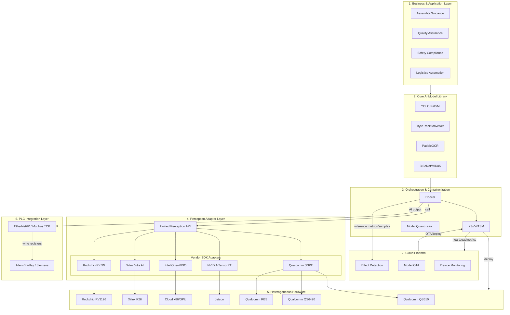

# Configurable Industrial Camera Solution

> Software-Defined Camera · Industry 4.0 Adaptive Deployment Platform

---

## 1. Executive Summary

### One-Liner

**A configurable industrial vision adaptive deployment platform enabling "develop once, deploy everywhere."**

### Core Pain Points

- **Scenario Fragmentation**: North American SMB factories have diverse needs—safety (PPE), part counting, embodied AI—requiring custom solutions per scenario
- **Tight Hardware Binding**: Algorithms are tightly coupled to Qualcomm/NVIDIA/Intel hardware; switching hardware requires rewriting inference logic
- **High Deployment Cost**: On-site tuning, model retraining, multi-vendor SDK maintenance lead to long delivery cycles and high labor cost
- **PLC Disconnect**: AI cameras cannot communicate directly with factory PLCs (Allen-Bradley, Siemens), requiring extra gateways or custom development

### Solution

Through **Perception Adapter Layer** and **Algorithm Containerization**:

- **Select algorithm by scenario**: Customers define "what to detect" without caring about underlying compute
- **Select hardware by compute**: Same model deploys to Qualcomm QS610/QS6490/RB5, Jetson, Xilinx K26, Rockchip RV1126, or cloud x86/GPU
- **PLC plug-and-play**: Camera acts as standard industrial sensor, writing directly to PLC registers via EtherNet/IP or Modbus TCP for closed-loop control
- **Cloud platform control**: Unified device monitoring, automatic model rollout, automatic effect verification, remote OTA and effect feedback loop

### Target Markets

- North American SMB factories (assembly guidance, quality assurance, safety compliance, logistics automation)
- Embodied AI and robotic grasping
- Cross-factory long-term data analysis

---

## 2. Vision & Value Proposition

### Vision

Become the **"Software-Defined Camera"** standard platform for Industry 4.0—configurable, orchestratable, and portable like cloud computing.

### Value Proposition

| Dimension | Traditional | This Solution |
|-----------|-------------|---------------|
| Customer view | Must understand hardware brands, SDK differences | Only care "can it detect hard hat / parts / defects" |
| Algorithm deployment | Switching hardware requires rewriting inference code | Same model deploys to Qualcomm, Jetson, Xilinx K26, Rockchip RV1126, etc. |
| Iteration speed | On-site tuning, manual updates | Container orchestration, remote OTA |
| PLC integration | Extra gateways, custom development | Camera plug-and-play, direct PLC register writes, closed-loop control |
| Model iteration | Manual on-site updates, hard to verify effect | Cloud auto rollout, auto effect detection, remote OTA |

---

## 3. Technical Architecture

### 3.1 Overview

Layered design with **Perception Adapter Layer** and **Orchestration Layer** at the core, fully separating algorithm logic from underlying compute.

### 3.2 Layer Deep Dive

#### Layer 1: Business & Application Layer

**Definition**: What the customer actually needs.

**Adaptive logic**: Customers don't care about hardware brand. They care "I need to detect workers without hard hats." The business layer maps this to specific AI model calls (e.g., YOLO).

#### Layer 2: Core AI Model Library

**Definition**: Algorithm arsenal, framework-agnostic.

**Adaptive logic**: Models (e.g., ONNX YOLOv8) contain no hardware-specific code. Pure math, quickly retrainable for new scenarios (e.g., hard hat → carton defect).

**Typical components**: YOLO/PaDiM/PatchCore (detection/anomaly), ByteTrack/MoveNet (tracking/pose), PaddleOCR (recognition), BiSeNet/MiDaS (segmentation/depth), 1D-CNN/CRNN (audio).

#### Layer 3: Orchestration & Containerization Layer

**Definition**: Key to fast deployment.

**Adaptive logic**: Docker containers package algorithms and dependencies (OpenCV, etc.). Model quantization tools perform INT8 quantization per target hardware—SNPE for Qualcomm, TensorRT for NVIDIA.

**Orchestration (K3s)**: Decides whether containers run in-camera, at edge gateway, or in cloud based on compute and network.

#### Layer 4: Perception Adapter Layer (HAL)

**Definition**: The "soul" of decoupling.

**Unified Perception API**: Standard interfaces (C++/Python) for image input, inference, I/O. Same for all algorithm containers.

**Vendor SDK adapters**: When a container requests inference, the API routes to the right backend—Qualcomm→SNPE, Jetson→TensorRT, Intel→OpenVINO, K26→Vitis AI, Rockchip→RKNN.

**ISP tuning**: Vendor-specific ISP tuning for consistent image quality under complex factory lighting.

#### Layer 5: Heterogeneous Hardware Layer

**Definition**: Physical execution devices.

| Platform | Use Case | Features | Adapter |
|----------|----------|----------|---------|
| Qualcomm QS610 | Lightweight Smart Camera | Low power, compact, entry-level edge | SNPE |
| Qualcomm QS6490 | High-performance Smart Camera | Multi-camera, high throughput, industrial | SNPE |
| Qualcomm RB5 | Edge AI dev board | DSP, multi-input, audio, ISP | SNPE |
| NVIDIA Jetson | L3 embodied AI | Multi-camera, offline LLM | TensorRT |
| Rockchip RV1126 | Lightweight, cost-sensitive | NPU, RKNN, low power | RKNN |
| Xilinx K26 (Kria) | Industrial vision, ultra-low latency | DPU, Vitis AI, programmable | Vitis AI |
| Cloud (x86/GPU) | Cross-factory analysis | Long-term analytics, retraining | OpenVINO/TensorRT |

#### Layer 6: PLC Integration Layer

**Definition**: Write AI results to factory PLC for closed-loop control.

**Core logic**: Camera acts as Server/Adapter. Via EtherNet/IP or Modbus TCP, writes count, safety alert, line status to PLC registers. PLC reads every few ms and can stop conveyor, trigger alarm, or reject.

**See**: [Section 5. PLC Integration Strategy](#5-plc-integration-strategy)

#### Layer 7: Cloud Platform

**Definition**: Unified edge monitoring, automatic model rollout, automatic effect detection, remote OTA and effect feedback loop.

**Core capabilities**: Device monitoring, model versioning, auto-deploy, effect metrics and alerts.

**See**: [Section 6. Cloud Platform](#6-cloud-platform-monitoring--management)

---

## 4. Smart Factory Scenarios & AI Models

### 4.1 Human-Augmented Assembly (手動組裝指引與錯誤預防)

**Value**: Reduce quality issues from human error. In-process verification, visual SOP, digital traveler for traceability.

| Capability | Description |
|------------|-------------|
| In-process verification | Real-time monitoring of assembly actions (e.g., missing washer, torque sequence) |
| Visual SOP | On-screen prompts or voice alerts on error; closed-loop correction, less rework |
| Digital traveler | Auto-capture photos linked to serial number; 100% image traceability for aerospace/medical |

**Models**: Pose/keypoint, object detection, sequence recognition. **Hardware**: QS6490, RB5, Jetson, K26.

### 4.2 Quality Assurance & Zero-Defect (高精度質量保證)

**Value**: AI replaces human inspection for finer, faster quality checks.

| Capability | Description |
|------------|-------------|
| Micro-defect detection | PCB solder defects, micro-cracks, part orientation, wrong-part assembly |
| OCR/OCV | Auto-read labels, wire encoding, batch numbers; verify placement and content |
| 3D dimension measurement | With ToF; shape deviation, stack height; assembly precision |

**Models**: YOLO, PaDiM, PatchCore, PaddleOCR. **Hardware**: QS610, QS6490, RB5, Xilinx K26.

### 4.3 Safety & Compliance (安全與合規性監控)

**Value**: AI camera as round-the-clock safety manager.

| Capability | Description |
|------------|-------------|
| PPE detection | Hard hat, safety vest, mask before entering |
| Virtual fence | No-go zones (robot range, high-voltage); alarm or PLC stop on intrusion |
| Behavior risk analysis | Unsafe actions (climbing, fall), prolonged stay in narrow corridor |

**Models**: MoveNet, SSD-MobileNet, YOLO. **Hardware**: QS6490, RB5.

### 4.4 Logistics & Throughput (生態位優化與物流自動化)

**Value**: Improve material flow and throughput.

| Capability | Description |
|------------|-------------|
| Bottleneck analysis | Heatmap, cycle time; identify dwell points; optimize shifts |
| Auto sorting | Identify material type, barcode; signal sorting robot for stacking/boxing |
| AMR/AGV navigation | Obstacle avoidance, environment perception; human-machine mixed env |

**Models**: BiSeNetV2, MiDaS, YOLO, ByteTrack. **Hardware**: RB5, Jetson, Xilinx K26.

### 4.5 Scenario & Hardware Overview

| Scenario | Needs | Hardware | Algorithms |
|----------|-------|----------|------------|
| Assembly guidance | In-process verification, SOP, traceability | QS6490, RB5, Jetson, K26 | Pose, YOLO, sequence |
| Quality assurance | Defect, OCR, 3D measurement | QS610/QS6490/RB5/K26 | YOLO, PaDiM, PaddleOCR |
| Safety compliance | PPE, virtual fence, behavior | QS6490, RB5 | MoveNet, SSD-MobileNet, YOLO |
| Logistics automation | Bottleneck, sorting, AMR nav | RB5, Jetson, K26 | BiSeNetV2, MiDaS, YOLO |
| Cross-factory analytics | Long-term, large-scale | Cloud | Retraining + batch inference |

### 4.6 Demo Model Priority

| Priority | Scenario | Model | Format | Reason |
|----------|----------|-------|--------|--------|
| **P0** | Quality assurance / defect detection | YOLOv8-Nano | TFLite | Fastest deploy, clear visuals, rich pretrained weights |
| **P1** | Safety compliance / PPE monitoring | SSD-MobileNet | DLC | Stable, good RB5 low-power throughput demo |

---

## 5. PLC Integration Strategy

Industrial apps must integrate deeply with PLC. Camera as **White-Label Industrial AI Camera** must "speak" North American PLC language.

### 5.1 North American Standards

| Priority | PLC Brand | Protocol | Market |
|----------|-----------|----------|--------|
| **Primary** | Allen-Bradley (Rockwell) | EtherNet/IP | North American SMB |
| **Secondary** | Siemens / AutomationDirect | Modbus TCP, Profinet | Europe, mixed lines |

### 5.2 Two-Tier Communication

| Tier | Protocol | Function |
|------|----------|----------|
| **Tier 1: Deterministic** | EtherNet/IP, Modbus TCP | Camera writes AI results to PLC registers |
| **Tier 2: Information** | MQTT, OPC UA | Metadata, evidence images, efficiency stats to HMI/cloud |

**Closed loop**: PLC reads tags every few ms, can stop conveyor, trigger alarm, or reject.

### 5.3 Implementation Roadmap

| Component | Task |
|-----------|------|
| Protocol stack | Integrate OpENer (EtherNet/IP) or libmodbus on camera Linux |
| Data mapping | Memory Map document for electricians |
| EDS (optional) | Electronic Data Sheet for Studio 5000 drag-and-drop |

### 5.4 Connectivity Comparison

| Method | Latency | Complexity | Best For |
|--------|---------|------------|----------|
| Digital I/O | < 1ms | Low | E-stop, simple trigger |
| Modbus TCP | 10–50ms | Medium | Counting, status |
| EtherNet/IP | 10–50ms | High | North American SMB standard |
| MQTT | 100ms+ | Low | Analytics, remote dashboards |

### 5.5 Sales Value Proposition

| Point | Message |
|-------|---------|
| **No-code integration** | Camera appears as standard sensor in PLC environment |
| **Zero hardware change** | Mount camera, connect one Ethernet cable—no new sensors |
| **Closed-loop safety** | Camera actively tells PLC to shut down when worker enters danger zone |

---

## 6. Cloud Platform Monitoring & Management

Cloud is the **control center** for edge devices: monitoring, model OTA, effect detection, forming a "train → deploy → monitor → iterate" loop.

### 6.1 Core Capabilities

| Capability | Description |
|------------|-------------|
| **Device monitoring** | Online status, CPU/memory/temp, inference FPS, PLC connection |
| **Model auto rollout** | Push new models, edge auto-pulls and switches, gray release |
| **Effect auto detection** | Confidence distribution, false/miss rates, key metrics, auto alerts |
| **Remote OTA** | Scene config, model version, params—no on-site ops |

### 6.2 Architecture

- Edge Agent: heartbeat, metrics, sample upload
- Cloud: dashboard, model registry, deploy engine, effect analyzer
- Flow: Agent → Cloud (metrics), Cloud → Edge (OTA)

### 6.3 Model Rollout Flow

1. Upload model to registry
2. Version and tag (scene, target hardware)
3. Select devices/groups, full or gray
4. Edge pulls and switches
5. Rollback on anomaly

### 6.4 Effect Detection

| Metric | Alert Condition |
|--------|-----------------|
| Inference latency | Exceeds threshold (e.g., 50ms) |
| Confidence distribution | Mean drop, outlier increase |
| False/miss rate | Exceeds baseline |
| Device health | Offline, CPU/memory anomaly |

### 6.5 Tech Stack

| Component | Choice |
|-----------|--------|
| Device access | MQTT / custom Agent |
| Model registry | Harbor / self-hosted |
| Deploy | Self-built / Argo CD |
| Monitoring | Prometheus + Grafana |
| Effect analysis | Self-built / MLflow |

---

## 7. Technical Execution Checklist

To land the architecture, the engineering team should prioritize the following:

### 7.1 P0: Define Unified Perception API

Define the **standard interface** between AI containers and the underlying runtime, e.g. `infer(image_raw, model_id)`. Containers call this interface only; they do not care whether the backend is SNPE or TensorRT. Cover: image input, inference trigger, result format, I/O control.

### 7.2 P0: Build SNPE and TensorRT Adapter Prototypes

- **Hardware**: Purchase one Qualcomm RB5 and one NVIDIA Jetson
- **Goal**: Run the same reference model (e.g. YOLOv8n) via the unified API on both boards
- **Purpose**: Prove "develop once, deploy everywhere" before expanding to more platforms

### 7.3 P1: Develop Model Optimization Automation (Quantization Pipeline)

- **Input**: ONNX model
- **Output**: SNPE INT8 DLC, TensorRT Engine
- **Tool**: PC-side pipeline (scripts or CLI)
- **Next**: Package outputs into Docker images for edge deployment

### 7.4 Full Checklist

| Priority | Task | Description |
|----------|------|-------------|
| P0 | Define unified perception API | Standard interface, e.g. `infer(image_raw, model_id)` |
| P0 | Build SNPE / TensorRT adapters | RB5 + Jetson, same YOLOv8n via API on both |
| P1 | Model optimization pipeline | ONNX → SNPE DLC / TensorRT Engine, package into Docker |
| P1 | ISP tuning | Consistent image quality across vendor cameras |
| P1 | PLC protocol stack | OpENer / libmodbus for AI result → PLC registers |
| P1 | Cloud device monitoring | Edge Agent heartbeat and metrics to cloud dashboard |
| P2 | Model auto rollout | Cloud registry + deploy engine, OTA to edge |
| P2 | Extend to more adapters | After SNPE/TRT validation, add Xilinx K26 (Vitis AI), Rockchip RV1126 (RKNN) |
| P2 | Effect auto detection | Confidence, latency metrics; alert and rollback on anomaly |
| P2 | Memory Map / EDS files | Modbus register map, Allen-Bradley EDS for drag-and-drop |

---

## 8. Differentiation & Competitive Moat

| Advantage | Description |
|-----------|-------------|
| **Algorithm-hardware decoupling** | Multi-hardware switch without code change |
| **Container orchestration** | K3s/WASM, edge-friendly, remote OTA |
| **Unified perception API** | One dev, multi-deploy |
| **Multi-vendor adapters** | Qualcomm, NVIDIA, Intel, Xilinx, Rockchip |
| **PLC plug-and-play** | EtherNet/IP, Modbus TCP, standard sensor |
| **Cloud platform** | Monitor, OTA, effect loop |

---

## 9. Business Model & Milestones

### Business Model Options

- Per deployment (camera/stream, monthly/annual)
- Per algorithm subscription (PPE, counting, defect, etc.)

### MVP Milestones

1. Multi-platform adapter prototype
2. Single-scenario demo (PPE or counting)
3. Quantization pipeline
4. PLC integration demo
5. Cloud platform MVP (monitoring + OTA + effect metrics)

### Next Steps

- Sample EDS file for Allen-Bradley
- Modbus Register Map template

---

## Appendix: Supported Hardware

| Platform | Models | Engine | Use Case |
|----------|--------|--------|----------|
| Qualcomm | QS610, QS6490, RB5 | SNPE/QNN | Smart Camera, edge AI |
| NVIDIA | Jetson Orin/Xavier | TensorRT | Embodied AI, LLM |
| Rockchip | RV1126, RK3588, RK3568 | RKNN | Lightweight, cost-sensitive |
| Xilinx | K26 (Kria SOM) | Vitis AI | Industrial, ultra-low latency |
| Intel | x86 | OpenVINO | Cloud, batch inference |
| Cloud | x86 + GPU | TensorRT/OpenVINO | Retraining, cross-factory |

---

*Document v1.3 · For investors, engineering, customers · QS610/QS6490/RB5/Xilinx K26/Rockchip RV1126 · PLC + Cloud Platform*
