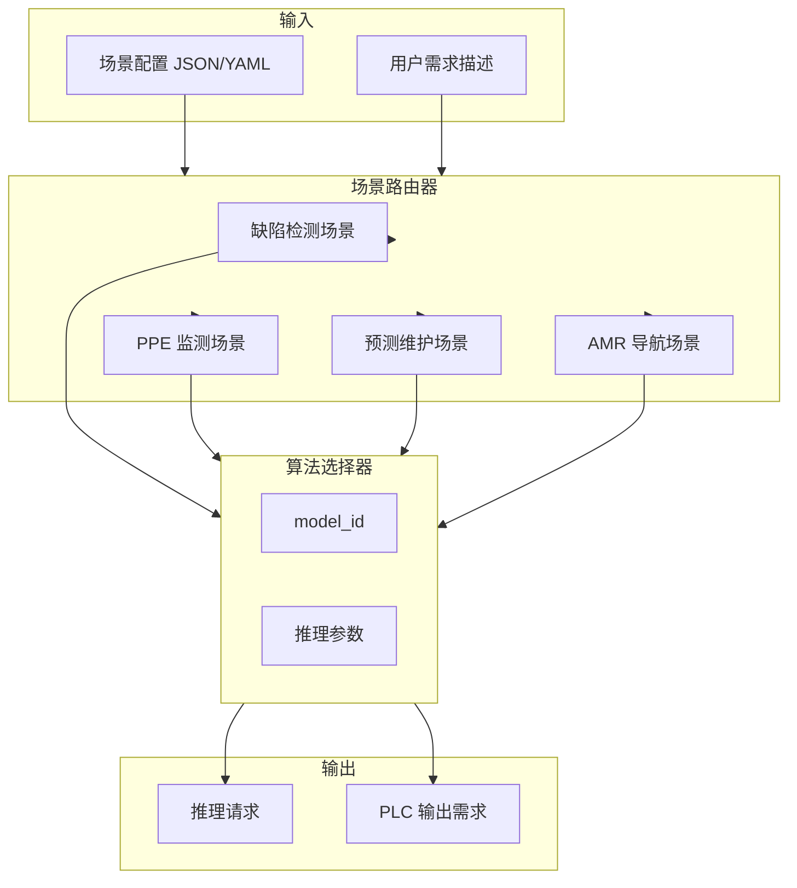
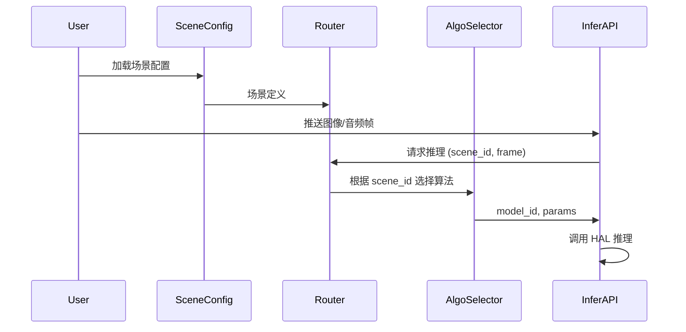

# 第 1 层：用户业务与应用场景层 — 高层架构设计

## 1. 层概述

### 1.1 定位

用户业务与应用场景层 (Business & Application Layer) 是系统的**北向入口**，负责将客户的业务需求（「检测什么」）转化为对底层算法与硬件的调用请求。客户不关心硬件品牌，只关心能否满足场景需求。

### 1.2 设计原则

- **场景驱动**：以场景定义需求，而非以技术定义产品
- **声明式配置**：通过配置描述「检测安全帽」「计件」「缺陷剔除」，而非编写推理代码
- **与硬件解耦**：业务逻辑不依赖具体算力平台

---

## 2. 架构图



---

## 3. 核心组件

### 3.1 场景配置 (Scene Configuration)

| 组件 | 职责 | 输入 | 输出 |
|------|------|------|------|
| 场景描述文件 | 定义场景类型、检测目标、阈值、PLC 映射 | JSON/YAML 配置 | 结构化场景定义 |
| 场景校验器 | 校验配置合法性、完整性 | 场景定义 | 校验结果 |

**配置示例**：

```yaml
scene:
  id: ppe_monitoring_001
  type: ppe_monitoring
  targets:
    - hard_hat
    - safety_vest
  thresholds:
    confidence: 0.85
  plc_mapping:
    safety_violation_register: 40001
    count_register: 40002
```

### 3.2 场景路由器 (Scene Router)

| 场景类型 | 目录 | 算法映射 | 典型输出 |
|----------|------|----------|----------|
| `defect_detection` | 01_business/defect_detection | YOLO / PaDiM / PatchCore | 缺陷框、类别、置信度 |
| `ppe_monitoring` | 01_business/ppe_monitoring | MoveNet、YOLO | 人体关键点、安全帽/背心检测 |
| `predictive_maintenance` | 01_business/predictive_maintenance | 1D-CNN、CRNN | 异常概率、剩余寿命 |
| `amr_navigation` | 01_business/amr_navigation | BiSeNet、MiDaS | 语义图、深度图 |

### 3.3 算法选择器 (Algorithm Selector)

根据场景类型与硬件能力，选择 `model_id` 及推理参数（输入尺寸、批大小、量化精度等）。

| 输入 | 输出 |
|------|------|
| 场景类型、硬件平台、算力等级 | model_id、input_size、batch_size、quantization |

---

## 4. 数据流



---

## 5. 接口定义

### 5.1 北向接口（对上层/用户）

| 接口 | 说明 |
|------|------|
| `load_scene(config_path)` | 加载场景配置 |
| `get_active_scene()` | 获取当前激活场景 |
| `switch_scene(scene_id)` | 切换场景（支持运行时切换） |

### 5.2 南向接口（对下层/算法层）

| 接口 | 说明 |
|------|------|
| `get_model_for_scene(scene_id)` | 返回 model_id、推理参数 |
| `get_plc_mapping(scene_id)` | 返回 PLC 寄存器映射（计数、告警、状态） |

---

## 6. 技术选型

| 维度 | 选型 | 理由 |
|------|------|------|
| 配置格式 | YAML / JSON | 可读性好、工具链成熟 |
| 运行时 | Python / C++ | Python 便于快速迭代，C++ 用于嵌入式 |
| 配置热加载 | 支持 | 支持现场调参不重启 |

---

## 7. 实现要点

1. **场景与算法解耦**：场景配置中仅引用 `model_id`，不硬编码模型路径
2. **PLC 映射可配置**：不同工厂 PLC 地址不同，需通过配置适配
3. **多场景并存**：单设备可支持多路相机、多场景（如 1 路 PPE + 1 路计件）
