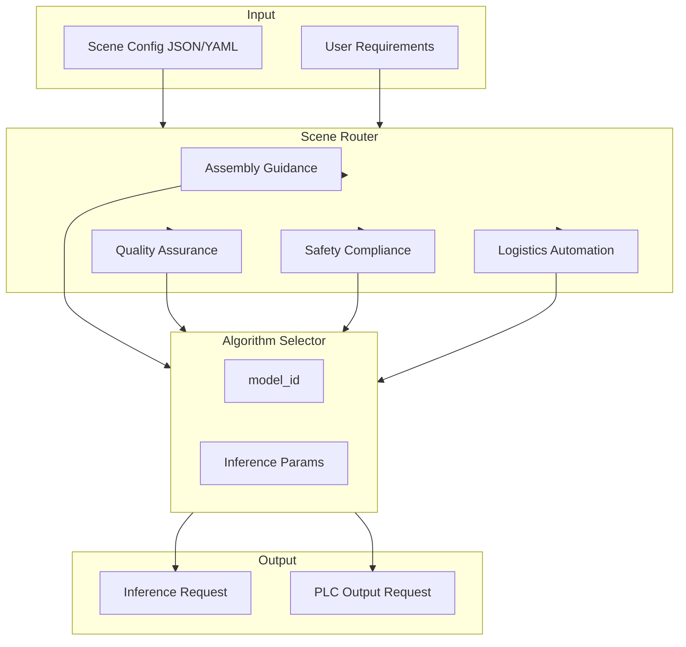
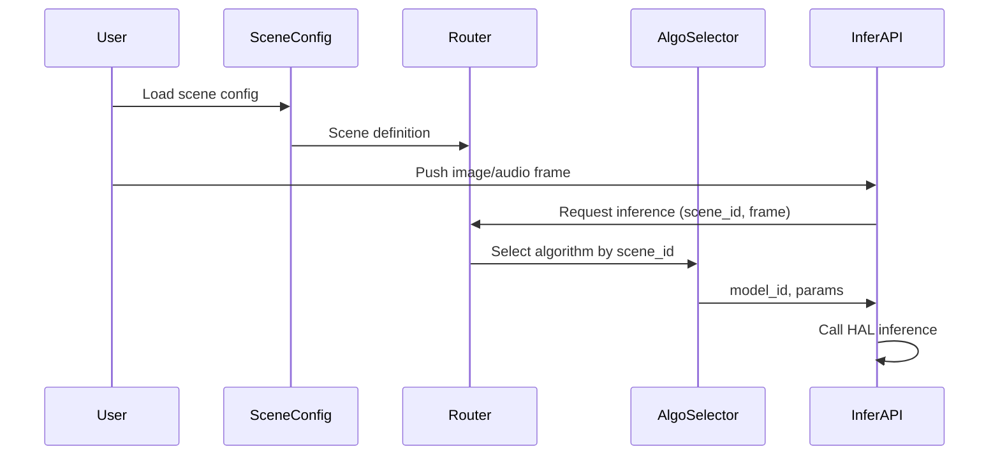

# Layer 1: Business & Application Layer — High-Level Architecture

## 1. Layer Overview

### 1.1 Role

The Business & Application Layer is the **northbound entry** of the system, mapping customer needs ("what to detect") into calls to algorithms and hardware. Customers don't care about hardware brands—only whether the scenario is satisfied.

### 1.2 Design Principles

- **Scenario-driven**: Define requirements by scenario, not by technology
- **Declarative config**: Describe "detect hard hat", "count parts", "reject defects" via config, not inference code
- **Hardware-decoupled**: Business logic independent of compute platform

---

## 2. Architecture Diagram



---

## 3. Core Components

### 3.1 Scene Configuration

| Component | Responsibility | Input | Output |
|-----------|-----------------|-------|--------|
| Scene descriptor | Define scene type, targets, thresholds, PLC mapping | JSON/YAML | Structured scene definition |
| Scene validator | Validate config legality and completeness | Scene definition | Validation result |

**Config example**:

```yaml
scene:
  id: ppe_monitoring_001
  type: ppe_monitoring
  targets:
    - hard_hat
    - safety_vest
  thresholds:
    confidence: 0.85
  plc_mapping:
    safety_violation_register: 40001
    count_register: 40002
```

### 3.2 Scene Router

| Scene Type | Directory | Algorithm Mapping | Typical Output |
|------------|-----------|-------------------|----------------|
| `assembly_guidance` | 01_business/assembly_guidance | Pose, YOLO, sequence models | step verification, SOP prompt |
| `quality_assurance` | 01_business/quality_assurance | YOLO, PaDiM, PaddleOCR, 3D | defect, label, dimension |
| `safety_compliance` | 01_business/safety_compliance | MoveNet, YOLO | PPE, zone intrusion, behavior risk |
| `logistics_automation` | 01_business/logistics_automation | BiSeNet, MiDaS, YOLO | bottleneck, sorting, AMR nav |

### 3.3 Algorithm Selector

Selects `model_id` and inference params (input size, batch size, quantization) based on scene type and hardware capability.

| Input | Output |
|-------|--------|
| Scene type, hardware platform, compute tier | model_id, input_size, batch_size, quantization |

---

## 4. Data Flow



---

## 5. Interface Definition

### 5.1 Northbound (to user)

| Interface | Description |
|-----------|-------------|
| `load_scene(config_path)` | Load scene config |
| `get_active_scene()` | Get active scene |
| `switch_scene(scene_id)` | Switch scene (runtime) |

### 5.2 Southbound (to algorithm layer)

| Interface | Description |
|-----------|-------------|
| `get_model_for_scene(scene_id)` | Return model_id, inference params |
| `get_plc_mapping(scene_id)` | Return PLC register mapping (count, alert, status) |

---

## 6. Tech Choices

| Dimension | Choice | Reason |
|-----------|--------|--------|
| Config format | YAML / JSON | Readable, mature tooling |
| Runtime | Python / C++ | Python for iteration, C++ for embedded |
| Hot reload | Supported | On-site tuning without restart |

---

## 7. Implementation Notes

1. **Scene-algorithm decoupling**: Config references `model_id` only, no hardcoded paths
2. **PLC mapping configurable**: Different factories use different PLC addresses
3. **Multi-scene coexistence**: Single device can run multiple cameras/scenes (e.g., 1 PPE + 1 counting)
