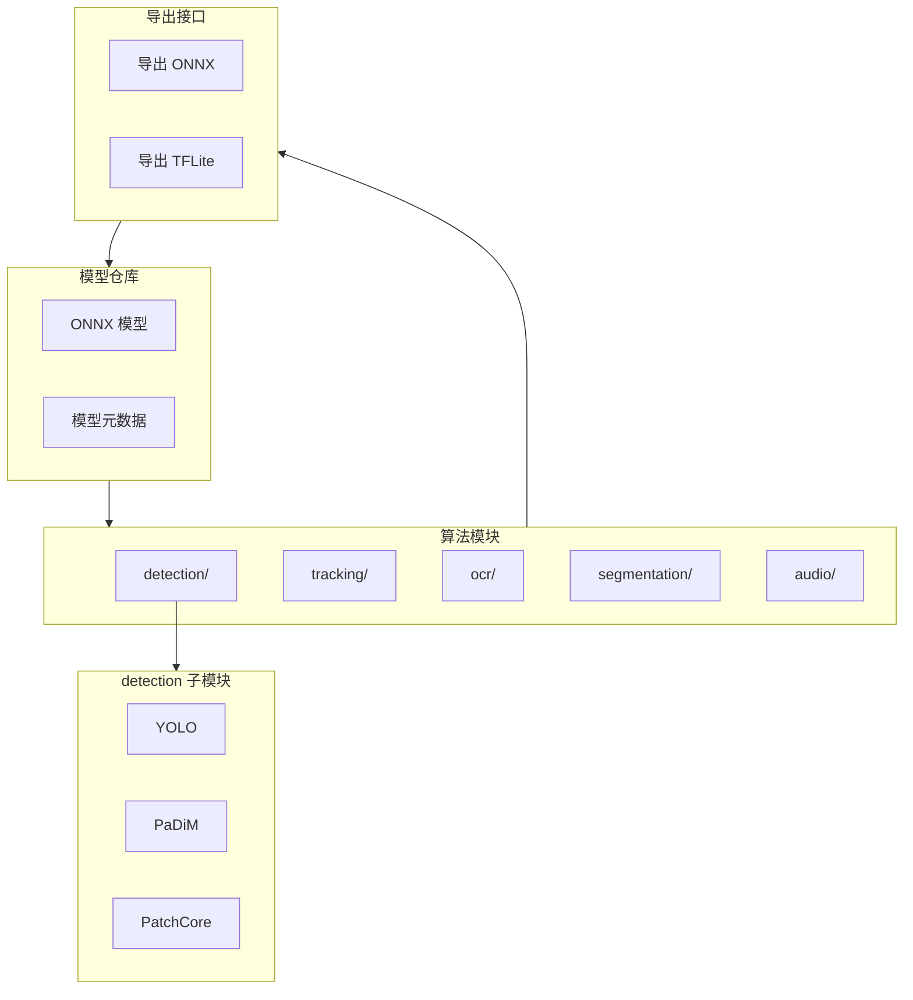
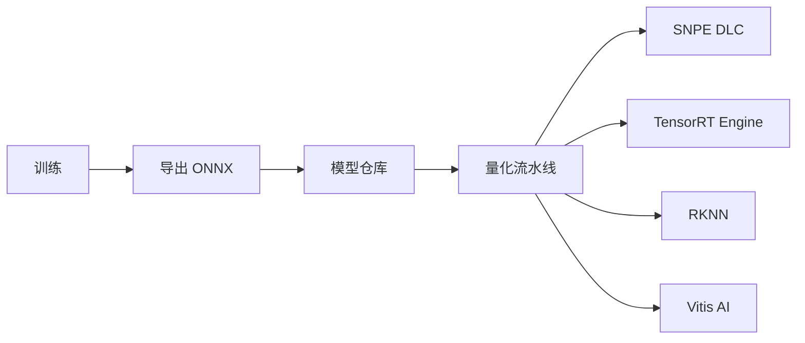

# 第 2 层：核心算法库 — 高层架构设计

## 1. 层概述

### 1.1 定位

核心算法库 (Core AI Model Library) 是系统的**算法武器库**，保持**框架中立 (Framework Agnostic)**。模型以 ONNX、PyTorch 等通用格式存储，不含任何硬件绑定代码，可快速重训以适应新场景。

### 1.2 设计原则

- **格式中立**：优先 ONNX，支持 TFLite、PyTorch 作为训练/导出中间格式
- **无硬件依赖**：模型文件不包含 SNPE、TensorRT 等厂商特定优化
- **可追溯**：每个模型附带元数据（训练数据、版本、精度指标）

---

## 2. 架构图



---

## 3. 模块划分

### 3.1 detection（检测 / 异常检测）

| 子模块 | 模型 | 格式 | 输入 | 输出 |
|--------|------|------|------|------|
| YOLO | YOLOv8/v10 | ONNX | 图像 | bbox, class, confidence |
| PaDiM | PaDiM | ONNX | 图像 | 异常分数 |
| PatchCore | PatchCore | ONNX | 图像 | 异常分数 |

### 3.2 tracking（追踪 / 姿态）

| 子模块 | 模型 | 格式 | 输入 | 输出 |
|--------|------|------|------|------|
| ByteTrack | ByteTrack | ONNX | 检测框序列 | 轨迹 ID |
| MoveNet | MoveNet.Thunder | TFLite | 图像 | 人体关键点 |

### 3.3 ocr（文字识别）

| 子模块 | 模型 | 格式 | 输入 | 输出 |
|--------|------|------|------|------|
| PaddleOCR | PP-OCR | ONNX | 图像 | 文本、框 |

### 3.4 segmentation（分割 / 深度）

| 子模块 | 模型 | 格式 | 输入 | 输出 |
|--------|------|------|------|------|
| BiSeNet | BiSeNetV2 | ONNX | 图像 | 语义图 |
| MiDaS | MiDaS | ONNX | 图像 | 深度图 |

### 3.5 audio（音频预测）

| 子模块 | 模型 | 格式 | 输入 | 输出 |
|--------|------|------|------|------|
| 1D-CNN | 自定义 | ONNX | 音频时序 | 异常概率 |
| CRNN | 自定义 | ONNX | 频谱图 | 异常概率 |

---

## 4. 模型元数据规范

```yaml
model_id: yolov8n_defect_v1
format: onnx
version: 1.0
input:
  shape: [1, 3, 640, 640]
  dtype: float32
output:
  - name: detections
    shape: [1, 84, 8400]
classes: [scratch, crack, missing_part]
training:
  dataset: internal_defect_2024
  mAP: 0.92
```

---

## 5. 数据流



- **训练阶段**：在 PC/云端完成，输出 ONNX
- **部署阶段**：量化流水线根据目标硬件生成对应格式，算法库仅提供 ONNX 源

---

## 6. 接口定义

### 6.1 对上层（业务层）

| 接口 | 说明 |
|------|------|
| `list_models()` | 列出可用 model_id |
| `get_model_meta(model_id)` | 获取模型元数据 |
| `get_input_spec(model_id)` | 获取输入尺寸、类型 |

### 6.2 对下层（HAL）

算法库**不直接调用 HAL**。HAL 通过 `model_id` 加载已量化的运行时模型。算法库仅负责：
- 存储 ONNX 源模型
- 提供元数据查询
- 与量化流水线对接

---

## 7. 目录结构

```
02_algorithms/
├── detection/
│   ├── yolo/           # YOLO 训练/导出脚本
│   ├── padim/          # PaDiM
│   └── patchcore/      # PatchCore
├── tracking/
│   ├── bytetrack/
│   └── movenet/
├── ocr/
│   └── paddleocr/
├── segmentation/
│   ├── bisenet/
│   └── midas/
├── audio/
│   ├── cnn1d/
│   └── crnn/
└── models/              # 模型仓库（ONNX 存储）
    └── metadata/        # 元数据 JSON/YAML
```

---

## 8. 技术选型

| 维度 | 选型 | 理由 |
|------|------|------|
| 主格式 | ONNX | 跨框架、厂商支持好 |
| 训练框架 | PyTorch | 生态丰富，导出 ONNX 简单 |
| 版本管理 | 语义化版本 + Git LFS | 模型文件大，需 LFS |
