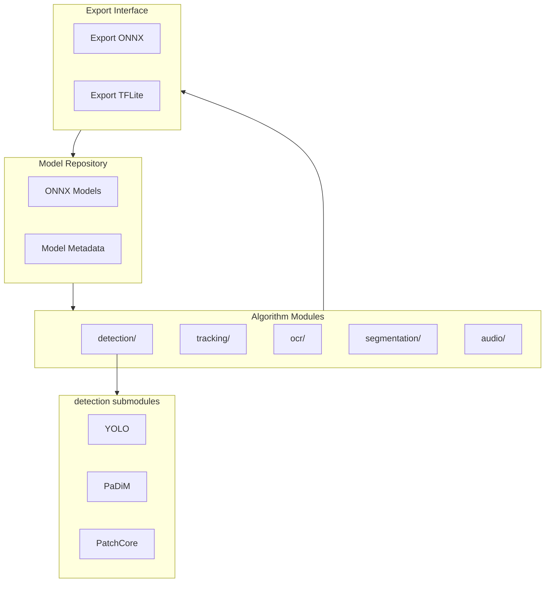
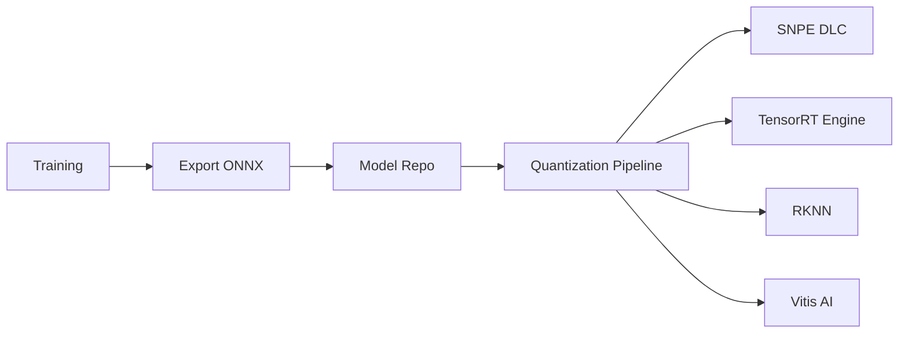

# Layer 2: Core AI Model Library — High-Level Architecture

## 1. Layer Overview

### 1.1 Role

The Core AI Model Library is the **algorithm arsenal**, **framework-agnostic**. Models stored in ONNX, PyTorch, etc., with no hardware binding, quickly retrainable for new scenarios.

### 1.2 Design Principles

- **Format-neutral**: Prefer ONNX, support TFLite, PyTorch as training/export intermediates
- **No hardware dependency**: No SNPE, TensorRT, etc. in model files
- **Traceable**: Each model has metadata (training data, version, metrics)

---

## 2. Architecture Diagram



---

## 3. Module Breakdown

### 3.1 detection

| Submodule | Model | Format | Input | Output |
|-----------|-------|--------|-------|--------|
| YOLO | YOLOv8/v10 | ONNX | Image | bbox, class, confidence |
| PaDiM | PaDiM | ONNX | Image | Anomaly score |
| PatchCore | PatchCore | ONNX | Image | Anomaly score |

### 3.2 tracking

| Submodule | Model | Format | Input | Output |
|-----------|-------|--------|-------|--------|
| ByteTrack | ByteTrack | ONNX | Detection sequence | Track ID |
| MoveNet | MoveNet.Thunder | TFLite | Image | Body keypoints |

### 3.3 ocr

| Submodule | Model | Format | Input | Output |
|-----------|-------|--------|-------|--------|
| PaddleOCR | PP-OCR | ONNX | Image | Text, boxes |

### 3.4 segmentation

| Submodule | Model | Format | Input | Output |
|-----------|-------|--------|-------|--------|
| BiSeNet | BiSeNetV2 | ONNX | Image | Semantic map |
| MiDaS | MiDaS | ONNX | Image | Depth map |

### 3.5 audio

| Submodule | Model | Format | Input | Output |
|-----------|-------|--------|-------|--------|
| 1D-CNN | Custom | ONNX | Audio time series | Anomaly probability |
| CRNN | Custom | ONNX | Spectrogram | Anomaly probability |

---

## 4. Model Metadata Spec

```yaml
model_id: yolov8n_defect_v1
format: onnx
version: 1.0
input:
  shape: [1, 3, 640, 640]
  dtype: float32
output:
  - name: detections
    shape: [1, 84, 8400]
classes: [scratch, crack, missing_part]
training:
  dataset: internal_defect_2024
  mAP: 0.92
```

---

## 5. Data Flow



- **Training**: PC/cloud, output ONNX
- **Deployment**: Quantization pipeline produces target format; algorithm library provides ONNX source only

---

## 6. Interface Definition

### 6.1 To upper (business layer)

| Interface | Description |
|-----------|-------------|
| `list_models()` | List available model_id |
| `get_model_meta(model_id)` | Get model metadata |
| `get_input_spec(model_id)` | Get input shape, type |

### 6.2 To lower (HAL)

Algorithm library **does not call HAL directly**. HAL loads quantized runtime model by `model_id`. Algorithm library:
- Stores ONNX source models
- Provides metadata queries
- Interfaces with quantization pipeline

---

## 7. Directory Structure

```
02_algorithms/
├── detection/
│   ├── yolo/
│   ├── padim/
│   └── patchcore/
├── tracking/
│   ├── bytetrack/
│   └── movenet/
├── ocr/
│   └── paddleocr/
├── segmentation/
│   ├── bisenet/
│   └── midas/
├── audio/
│   ├── cnn1d/
│   └── crnn/
└── models/
    └── metadata/
```

---

## 8. Tech Choices

| Dimension | Choice | Reason |
|-----------|--------|--------|
| Primary format | ONNX | Cross-framework, vendor support |
| Training framework | PyTorch | Rich ecosystem, easy ONNX export |
| Versioning | Semver + Git LFS | Large model files |
