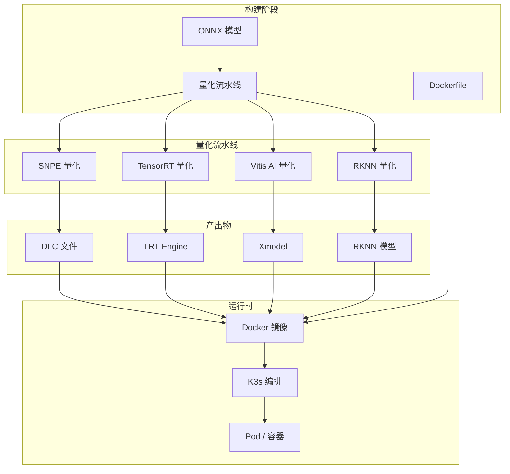
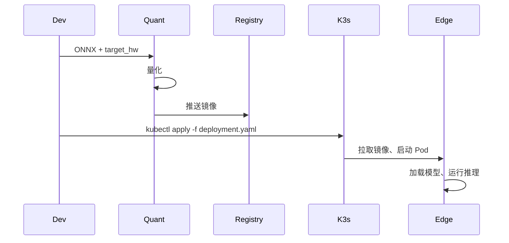

# 第 3 层：算法编排与容器化层 — 高层架构设计

## 1. 层概述

### 1.1 定位

算法编排与容器化层 (Orchestration & Containerization Layer) 是实现**快速布置**的关键。通过 Docker 容器打包算法与依赖，通过 K3s 进行輕量化编排，通过量化流水线针对目标硬件生成优化模型。

### 1.2 设计原则

- **一次构建、多端部署**：同一 Docker 镜像可部署到不同硬件（通过环境变量/配置区分）
- **輕量化**：边缘设备资源有限，K3s 替代完整 K8s
- **量化自动化**：ONNX → 各厂商格式的流水线可脚本化

---

## 2. 架构图



---

## 3. 核心组件

### 3.1 Docker 容器化

| 组件 | 职责 |
|------|------|
| 基础镜像 | 基于 Ubuntu 22.04 / Debian，预装 OpenCV、Python、HAL 运行时 |
| 场景镜像 | 按场景打包（defect、ppe、predictive、amr），内含对应模型与业务逻辑 |
| 多架构支持 | 支持 arm64（RB5、Jetson、RV1126）、x86_64（云端） |

**镜像层次**：

```
base:ubuntu22-opencv     # 基础运行时
  └── hal-runtime       # HAL API + 适配器
        └── scene-defect # 缺陷检测场景
        └── scene-ppe    # PPE 监测场景
        └── scene-predictive
        └── scene-amr
```

### 3.2 K3s 编排

| 组件 | 职责 |
|------|------|
| K3s Server | 边缘节点上的轻量 K8s，负责 Pod 调度 |
| Deployment | 定义副本数、资源限制、环境变量 |
| ConfigMap | 场景配置、PLC 地址等 |
| 设备选择 | 根据节点标签（如 `hardware=rb5`）调度到对应设备 |

**部署决策逻辑**：

- 相机内（QS610、RV1126）：单 Pod，资源受限
- 边缘网关（RB5、Jetson、K26）：可多 Pod，多路相机
- 云端：弹性扩展，批量推理

### 3.3 量化流水线 (Quantization Pipeline)

| 目标硬件 | 工具链 | 输入 | 输出 |
|----------|--------|------|------|
| Qualcomm | SNPE | ONNX | DLC |
| NVIDIA | TensorRT | ONNX | Engine |
| Xilinx K26 | Vitis AI | ONNX | Xmodel + 编译后 |
| Rockchip | RKNN-Toolkit2 | ONNX | RKNN |
| Intel/Cloud | OpenVINO | ONNX | IR |

**流水线步骤**：

1. 校验 ONNX 模型
2. 根据目标选择量化工具
3. 执行 INT8 量化（含校准数据）
4. 验证量化后精度
5. 打包进 Docker 镜像或输出到模型目录

---

## 4. 数据流



---

## 5. 接口定义

### 5.1 量化流水线 CLI

```bash
quantize --model model.onnx --target snpe --output model.dlc
quantize --model model.onnx --target tensorrt --output model.engine
quantize --model model.onnx --target rknn --output model.rknn
quantize --model model.onnx --target vitis_ai --output model.xmodel
```

### 5.2 K3s 部署清单

```yaml
apiVersion: apps/v1
kind: Deployment
metadata:
  name: scene-defect
spec:
  replicas: 1
  selector:
    matchLabels:
      app: defect
  template:
    spec:
      nodeSelector:
        hardware: rb5
      containers:
        - name: defect
          image: registry/scene-defect:latest
          env:
            - name: HAL_BACKEND
              value: snpe
            - name: PLC_PROTOCOL
              value: modbus_tcp
```

---

## 6. 目录结构

```
03_orchestration/
├── docker/
│   ├── base/
│   │   └── Dockerfile
│   ├── scenes/
│   │   ├── defect/
│   │   ├── ppe/
│   │   ├── predictive/
│   │   └── amr/
│   └── build.sh
├── k3s/
│   ├── deployments/
│   ├── configmaps/
│   └── install-k3s.sh
└── quantization/
    ├── snpe/
    ├── tensorrt/
    ├── vitis_ai/
    ├── rknn/
    └── quantize.py
```

---

## 7. 技术选型

| 维度 | 选型 | 理由 |
|------|------|------|
| 容器 | Docker | 工业界标准 |
| 编排 | K3s | 轻量、适合边缘 |
| 镜像仓库 | 私有 Registry / Harbor | 内网部署 |
| 量化 | 各厂商官方工具 | SNPE、TensorRT、Vitis AI、RKNN-Toolkit2 |
