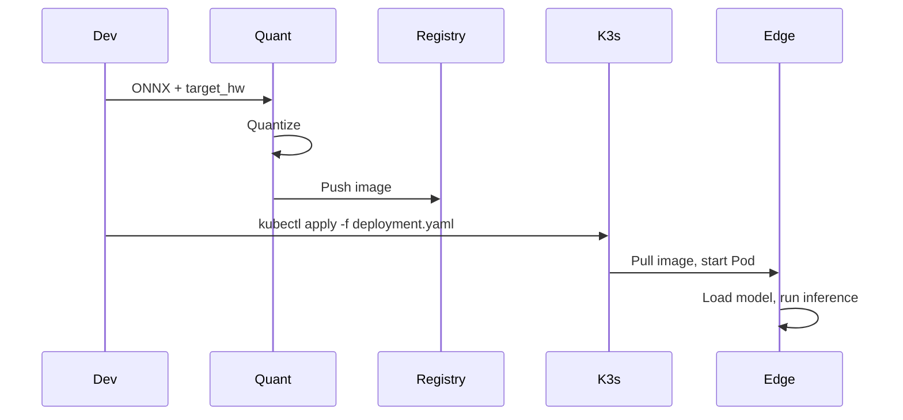

# Layer 3: Orchestration & Containerization — High-Level Architecture

## 1. Layer Overview

### 1.1 Role

The Orchestration & Containerization Layer is key to **fast deployment**. Docker packages algorithms and dependencies, K3s provides lightweight orchestration, and the quantization pipeline produces hardware-optimized models.

### 1.2 Design Principles

- **Build once, deploy everywhere**: Same Docker image to different hardware (env/config distinguishes)
- **Lightweight**: Edge resources limited; K3s instead of full K8s
- **Quantization automation**: ONNX → vendor formats scriptable

---

## 2. Architecture Diagram

```mermaid
flowchart TB
    subgraph Build [Build Phase]
        ONNX[ONNX Model]
        Dockerfile[Dockerfile]
        QuantPipeline[Quantization Pipeline]
    end

    subgraph QuantPipelineDetail [Quantization Pipeline]
        SNPEQuant[SNPE Quant]
        TRTQuant[TensorRT Quant]
        VitisQuant[Vitis AI Quant]
        RKNNQuant[RKNN Quant]
    end

    subgraph Artifacts [Artifacts]
        DLC[DLC]
        Engine[TRT Engine]
        Xmodel[Xmodel]
        RKNNModel[RKNN Model]
    end

    subgraph Runtime [Runtime]
        DockerImg[Docker Image]
        K3s[K3s Orchestration]
        Pod[Pod / Container]
    end

    ONNX --> QuantPipeline
    QuantPipeline --> SNPEQuant
    QuantPipeline --> TRTQuant
    QuantPipeline --> VitisQuant
    QuantPipeline --> RKNNQuant
    SNPEQuant --> DLC
    TRTQuant --> Engine
    VitisQuant --> Xmodel
    RKNNQuant --> RKNNModel
    DLC --> DockerImg
    Engine --> DockerImg
    Xmodel --> DockerImg
    RKNNModel --> DockerImg
    Dockerfile --> DockerImg
    DockerImg --> K3s
    K3s --> Pod
```



---

## 3. Core Components

### 3.1 Docker Containerization

| Component | Responsibility |
|-----------|----------------|
| Base image | Ubuntu 22.04/Debian, OpenCV, Python, HAL runtime |
| Scene images | Per-scenario (defect, ppe, predictive, amr) with models and logic |
| Multi-arch | arm64 (RB5, Jetson, RV1126), x86_64 (cloud) |

**Image hierarchy**:

```
base:ubuntu22-opencv
  └── hal-runtime
        └── scene-defect
        └── scene-ppe
        └── scene-predictive
        └── scene-amr
```

### 3.2 K3s Orchestration

| Component | Responsibility |
|-----------|----------------|
| K3s Server | Lightweight K8s on edge, Pod scheduling |
| Deployment | Replicas, resource limits, env vars |
| ConfigMap | Scene config, PLC addresses |
| Node selection | Schedule by label (e.g., `hardware=rb5`) |

**Deployment logic**:

- In-camera (QS610, RV1126): Single Pod, constrained
- Edge gateway (RB5, Jetson, K26): Multi-Pod, multi-camera
- Cloud: Elastic, batch inference

### 3.3 Quantization Pipeline

| Target | Toolchain | Input | Output |
|--------|-----------|-------|--------|
| Qualcomm | SNPE | ONNX | DLC |
| NVIDIA | TensorRT | ONNX | Engine |
| Xilinx K26 | Vitis AI | ONNX | Xmodel |
| Rockchip | RKNN-Toolkit2 | ONNX | RKNN |
| Intel/Cloud | OpenVINO | ONNX | IR |

**Pipeline steps**:

1. Validate ONNX
2. Select quantization tool by target
3. INT8 quantization (with calibration data)
4. Verify post-quant accuracy
5. Package into Docker or output to model dir

---

## 4. Data Flow



---

## 5. Interface Definition

### 5.1 Quantization CLI

```bash
quantize --model model.onnx --target snpe --output model.dlc
quantize --model model.onnx --target tensorrt --output model.engine
quantize --model model.onnx --target rknn --output model.rknn
quantize --model model.onnx --target vitis_ai --output model.xmodel
```

### 5.2 K3s Deployment

```yaml
apiVersion: apps/v1
kind: Deployment
metadata:
  name: scene-defect
spec:
  replicas: 1
  selector:
    matchLabels:
      app: defect
  template:
    spec:
      nodeSelector:
        hardware: rb5
      containers:
        - name: defect
          image: registry/scene-defect:latest
          env:
            - name: HAL_BACKEND
              value: snpe
            - name: PLC_PROTOCOL
              value: modbus_tcp
```

---

## 6. Directory Structure

```
03_orchestration/
├── docker/
│   ├── base/
│   ├── scenes/
│   └── build.sh
├── k3s/
│   ├── deployments/
│   ├── configmaps/
│   └── install-k3s.sh
└── quantization/
    ├── snpe/
    ├── tensorrt/
    ├── vitis_ai/
    ├── rknn/
    └── quantize.py
```

---

## 7. Tech Choices

| Dimension | Choice | Reason |
|-----------|--------|--------|
| Container | Docker | Industry standard |
| Orchestration | K3s | Lightweight, edge-friendly |
| Registry | Private Registry / Harbor | On-prem |
| Quantization | Vendor tools | SNPE, TensorRT, Vitis AI, RKNN-Toolkit2 |
