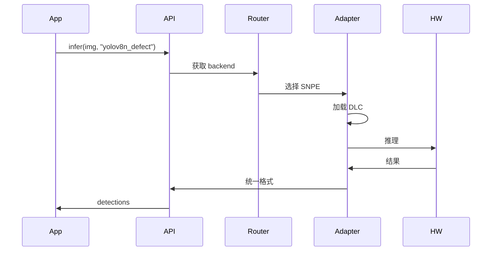

# 第 4 层：感知适配层 (HAL) — 高层架构设计

## 1. 层概述

### 1.1 定位

感知适配层 (Perception Adapter Layer / HAL) 是整个系统实现**算法与硬件解耦**的核心。对上提供统一感知 API，对下通过厂商 SDK 适配器映射到具体硬件。算法容器只需调用统一接口，无需关心底层是 SNPE、TensorRT 还是 RKNN。

### 1.2 设计原则

- **统一 API**：图像输入、推理、I/O 接口一致
- **运行时选型**：根据环境变量或设备检测自动选择适配器
- **可扩展**：新增硬件平台仅需实现适配器接口

---

## 2. 架构图

```mermaid
flowchart TB
    subgraph Upper [上层：算法容器]
        App[业务逻辑]
        InferCall[infer(image, model_id)]
    end

    subgraph HAL [感知适配层]
        API[统一感知 API]
        Router[适配器路由器]
        subgraph Adapters [厂商适配器]
            SNPE[SNPE Adapter]
            TRT[TensorRT Adapter]
            OpenVINO[OpenVINO Adapter]
            VitisAI[Vitis AI Adapter]
            RKNN[RKNN Adapter]
        end
    end

    subgraph Lower [下层：硬件]
        QCS[Qualcomm]
        Jetson[NVIDIA Jetson]
        x86[Intel x86]
        K26[Xilinx K26]
        RV1126[RV1126]
    end

    App --> InferCall
    InferCall --> API
    API --> Router
    Router --> SNPE
    Router --> TRT
    Router --> OpenVINO
    Router --> VitisAI
    Router --> RKNN
    SNPE --> QCS
    TRT --> Jetson
    OpenVINO --> x86
    VitisAI --> K26
    RKNN --> RV1126
```

---

## 3. 核心组件

### 3.1 统一感知 API

| 接口 | 签名 | 说明 |
|------|------|------|
| `init(backend?)` | 初始化，可选指定 backend | 不指定则自动检测 |
| `infer(image, model_id)` | 同步推理 | 返回检测框、类别、置信度等 |
| `infer_async(image, model_id, callback)` | 异步推理 | 适合高吞吐 |
| `get_image_source(stream_id)` | 获取图像源 | 相机/视频流 |
| `set_io(pin, value)` | GPIO 等 I/O | 可选，用于简单触发 |

**数据格式**：

- 输入：`numpy.ndarray` (H, W, C) 或 `bytes`（裸数据）
- 输出：统一结构，如 `{detections: [...], metadata: {...}}`

### 3.2 适配器路由器 (Adapter Router)

| 逻辑 | 说明 |
|------|------|
| 环境变量 | `HAL_BACKEND=snpe|tensorrt|openvino|vitis_ai|rknn` |
| 自动检测 | 读取 `/proc/device-tree`、CPU 信息等判断平台 |
| 回退 | 指定 backend 不可用时，尝试其他 |

### 3.3 厂商适配器

| 适配器 | 目标硬件 | 模型格式 | 关键 API |
|--------|----------|----------|----------|
| SNPE | QS610、QS6490、RB5 | DLC | SNPE Runtime C API |
| TensorRT | Jetson | Engine | TensorRT C++/Python API |
| OpenVINO | x86、Cloud | IR | openvino.runtime |
| Vitis AI | K26 | Xmodel | pyxir / VART |
| RKNN | RV1126 | RKNN | rknn-toolkit2 Runtime |

### 3.4 ISP 调优模块

| 功能 | 说明 |
|------|------|
| 3A 调优 | 自动曝光、自动白平衡、自动对焦 |
| HDR | 高动态范围，适应仓库内外光影变化 |
| 厂商 ISP 驱动 | 针对 Qualcomm、Rockchip 等 ISP 的调优参数 |

---

## 4. 数据流



---

## 5. 接口定义（C++ / Python 双语言）

### 5.1 Python 接口

```python
from hal import PerceptionAPI

api = PerceptionAPI(backend="snpe")  # 或 None 自动检测
result = api.infer(image, model_id="yolov8n_defect")
# result: {"detections": [...], "inference_time_ms": 12}
```

### 5.2 C++ 接口

```cpp
#include "hal/perception_api.h"

auto api = PerceptionAPI::Create(/*backend*/);
auto result = api->Infer(image, "yolov8n_defect");
```

### 5.3 适配器实现接口（内部）

```python
class BaseAdapter(ABC):
    @abstractmethod
    def load_model(self, model_id: str, model_path: str) -> None: ...

    @abstractmethod
    def infer(self, image: np.ndarray) -> dict: ...

    @abstractmethod
    def get_supported_formats(self) -> list[str]: ...
```

---

## 6. 目录结构

```
04_hal/
├── api/
│   ├── perception_api.py      # Python 统一 API
│   ├── perception_api.h       # C++ 头文件
│   └── types.py               # 通用类型定义
├── adapters/
│   ├── base.py                # BaseAdapter 抽象
│   ├── router.py              # 适配器路由
│   ├── snpe/
│   ├── tensorrt/
│   ├── openvino/
│   ├── vitis_ai/
│   └── rknn/
└── isp/
    ├── qualcomm/
    ├── rockchip/
    └── common/
```

---

## 7. 技术选型

| 维度 | 选型 | 理由 |
|------|------|------|
| 主语言 | Python + C++ | Python 易集成，C++ 用于嵌入式/性能敏感 |
| 模型加载 | 懒加载 | 按需加载，节省内存 |
| 线程模型 | 单线程推理 / 队列 | 避免多线程竞争，保证确定性 |

---

## 8. 实现要点

1. **模型路径解析**：`model_id` → 实际路径（由编排层挂载或配置）
2. **输入预处理**：归一化、resize 等在 API 层统一，适配器只做推理
3. **输出后处理**：NMS、解码等在 API 层统一，适配器输出原始 tensor
4. **错误处理**：适配器异常时返回明确错误码，便于排查
