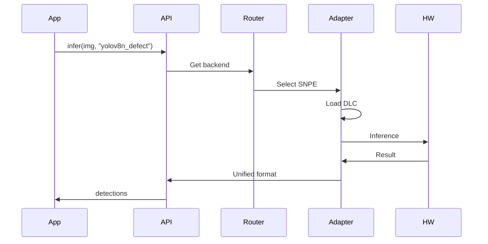

# Layer 4: Perception Adapter Layer (HAL) — High-Level Architecture

## 1. Layer Overview

### 1.1 Role

The Perception Adapter Layer (HAL) is the core of **algorithm-hardware decoupling**. It provides a unified perception API upward and maps to specific hardware via vendor SDK adapters. Algorithm containers call one interface regardless of SNPE, TensorRT, or RKNN underneath.

### 1.2 Design Principles

- **Unified API**: Same interfaces for image input, inference, I/O
- **Runtime selection**: Auto-select adapter via env var or device detection
- **Extensible**: New hardware = implement adapter interface

---

## 2. Architecture Diagram

```mermaid
flowchart TB
    subgraph Upper [Upper: Algorithm Container]
        App[Business Logic]
        InferCall[infer(image, model_id)]
    end

    subgraph HAL [Perception Adapter Layer]
        API[Unified Perception API]
        Router[Adapter Router]
        subgraph Adapters [Vendor Adapters]
            SNPE[SNPE Adapter]
            TRT[TensorRT Adapter]
            OpenVINO[OpenVINO Adapter]
            VitisAI[Vitis AI Adapter]
            RKNN[RKNN Adapter]
        end
    end

    subgraph Lower [Lower: Hardware]
        QCS[Qualcomm]
        Jetson[NVIDIA Jetson]
        x86[Intel x86]
        K26[Xilinx K26]
        RV1126[RV1126]
    end

    App --> InferCall
    InferCall --> API
    API --> Router
    Router --> SNPE
    Router --> TRT
    Router --> OpenVINO
    Router --> VitisAI
    Router --> RKNN
    SNPE --> QCS
    TRT --> Jetson
    OpenVINO --> x86
    VitisAI --> K26
    RKNN --> RV1126
```

---

## 3. Core Components

### 3.1 Unified Perception API

| Interface | Signature | Description |
|-----------|-----------|-------------|
| `init(backend?)` | Init, optional backend | Auto-detect if not specified |
| `infer(image, model_id)` | Sync inference | Returns detections, class, confidence |
| `infer_async(image, model_id, callback)` | Async inference | For high throughput |
| `get_image_source(stream_id)` | Get image source | Camera/video stream |
| `set_io(pin, value)` | GPIO I/O | Optional, simple triggers |

**Data format**:

- Input: `numpy.ndarray` (H, W, C) or `bytes`
- Output: Unified structure, e.g. `{detections: [...], metadata: {...}}`

### 3.2 Adapter Router

| Logic | Description |
|-------|-------------|
| Env var | `HAL_BACKEND=snpe|tensorrt|openvino|vitis_ai|rknn` |
| Auto-detect | Read `/proc/device-tree`, CPU info to determine platform |
| Fallback | Try others if specified backend unavailable |

### 3.3 Vendor Adapters

| Adapter | Target | Model Format | Key API |
|---------|--------|--------------|---------|
| SNPE | QS610, QS6490, RB5 | DLC | SNPE Runtime C API |
| TensorRT | Jetson | Engine | TensorRT C++/Python API |
| OpenVINO | x86, Cloud | IR | openvino.runtime |
| Vitis AI | K26 | Xmodel | pyxir / VART |
| RKNN | RV1126 | RKNN | rknn-toolkit2 Runtime |

### 3.4 ISP Tuning Module

| Function | Description |
|----------|-------------|
| 3A tuning | Auto exposure, AWB, AF |
| HDR | High dynamic range for indoor/outdoor |
| Vendor ISP drivers | Tuning params for Qualcomm, Rockchip, etc. |

---

## 4. Data Flow



---

## 5. Interface Definition (C++ / Python)

### 5.1 Python

```python
from hal import PerceptionAPI

api = PerceptionAPI(backend="snpe")  # or None for auto-detect
result = api.infer(image, model_id="yolov8n_defect")
# result: {"detections": [...], "inference_time_ms": 12}
```

### 5.2 C++

```cpp
#include "hal/perception_api.h"

auto api = PerceptionAPI::Create(/*backend*/);
auto result = api->Infer(image, "yolov8n_defect");
```

### 5.3 Adapter Interface (internal)

```python
class BaseAdapter(ABC):
    @abstractmethod
    def load_model(self, model_id: str, model_path: str) -> None: ...

    @abstractmethod
    def infer(self, image: np.ndarray) -> dict: ...

    @abstractmethod
    def get_supported_formats(self) -> list[str]: ...
```

---

## 6. Directory Structure

```
04_hal/
├── api/
│   ├── perception_api.py
│   ├── perception_api.h
│   └── types.py
├── adapters/
│   ├── base.py
│   ├── router.py
│   ├── snpe/
│   ├── tensorrt/
│   ├── openvino/
│   ├── vitis_ai/
│   └── rknn/
└── isp/
    ├── qualcomm/
    ├── rockchip/
    └── common/
```

---

## 7. Tech Choices

| Dimension | Choice | Reason |
|-----------|--------|--------|
| Languages | Python + C++ | Python for integration, C++ for embedded/performance |
| Model loading | Lazy | On-demand, save memory |
| Threading | Single-thread / queue | Avoid race, deterministic |

---

## 8. Implementation Notes

1. **Model path resolution**: `model_id` → actual path (mounted or configured by orchestration)
2. **Input preprocessing**: Normalize, resize in API layer; adapter does inference only
3. **Output postprocessing**: NMS, decode in API layer; adapter outputs raw tensor
4. **Error handling**: Adapter returns clear error codes for debugging
