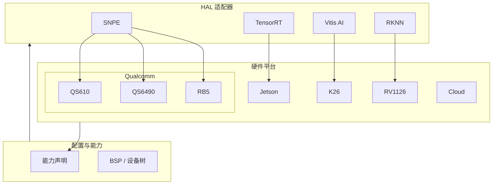

# 第 5 层：异构硬件算力层 — 高层架构设计

## 1. 层概述

### 1.1 定位

异构硬件算力层 (Physical Hardware Layer) 是**最终执行推理的物理设备**。本层不包含业务逻辑，仅提供硬件抽象、BSP 配置、设备树等，供 HAL 适配器与编排层使用。

### 1.2 设计原则

- **配置驱动**：通过配置文件描述硬件能力，而非硬编码
- **能力声明**：每个平台声明算力、内存、支持的模型格式
- **与 HAL 解耦**：硬件层不直接参与推理，由 HAL 适配器驱动

---

## 2. 架构图



---

## 3. 平台能力矩阵

| 平台 | 算力 | 内存 | 推理引擎 | 多路相机 | 音频 DSP | 典型场景 |
|------|------|------|----------|----------|----------|----------|
| QS610 | 低 | 1–2GB | SNPE | 1–2 | 否 | 轻量 Smart Camera |
| QS6490 | 中高 | 4GB+ | SNPE | 4+ | 否 | 多路工业相机 |
| RB5 | 中 | 8GB | SNPE | 多路 | 是 | 边缘 AI、预测维护 |
| Jetson | 高 | 8–32GB | TensorRT | 多路 | 否 | 具身智能、大模型 |
| K26 | 中高 | 4GB | Vitis AI | 多路 | 否 | 工业级、超低延迟 |
| RV1126 | 低 | 512MB–1GB | RKNN | 1–2 | 否 | 国产化、低成本 |
| Cloud | 弹性 | 弹性 | OpenVINO/TRT | N/A | N/A | 再训练、批量推理 |

---

## 4. 能力声明格式

```yaml
# configs/rb5.yaml
platform: qualcomm_rb5
adapter: snpe
capabilities:
  max_resolution: [1920, 1080]
  max_streams: 4
  memory_mb: 8192
  dsp: true
  isp: true
  supported_formats:
    - dlc
  quantization:
    - int8
    - fp16
```

---

## 5. 目录结构

```
05_hardware/
├── configs/
│   ├── qs610.yaml
│   ├── qs6490.yaml
│   ├── rb5.yaml
│   ├── jetson.yaml
│   ├── k26.yaml
│   └── rv1126.yaml
├── bsp/                  # 可选：BSP 补丁、设备树
│   ├── qualcomm/
│   ├── rockchip/
│   └── xilinx/
└── README.md
```

---

## 6. 与编排层协作

- 编排层根据 `nodeSelector` 或节点标签选择硬件
- 部署时挂载对应平台的 `configs/*.yaml`
- HAL 通过 `HAL_BACKEND` 或平台检测加载对应适配器

---

## 7. 实现要点

1. **能力查询 API**：运行时可查询当前平台能力，用于业务层选型
2. **热插拔**：支持 USB 相机等热插拔，设备变更时通知上层
3. **功耗与温度**：工业场景需考虑散热，能力声明中可包含功耗/温度限制
