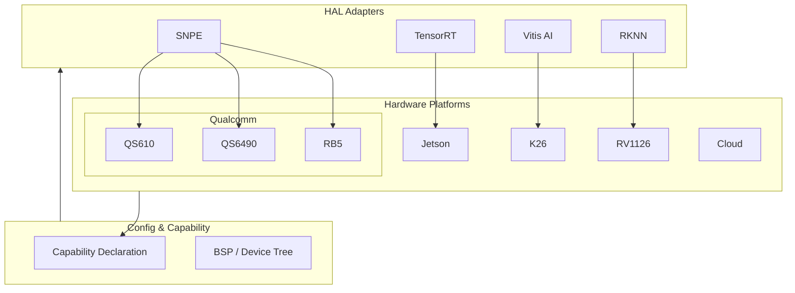

# Layer 5: Heterogeneous Hardware — High-Level Architecture

## 1. Layer Overview

### 1.1 Role

The Physical Hardware Layer is the **physical devices that execute inference**. No business logic here—only hardware abstraction, BSP config, device tree for HAL adapters and orchestration.

### 1.2 Design Principles

- **Config-driven**: Describe hardware capability via config, not hardcode
- **Capability declaration**: Each platform declares compute, memory, supported formats
- **HAL-decoupled**: Hardware layer does not run inference; HAL adapters drive it

---

## 2. Architecture Diagram



---

## 3. Platform Capability Matrix

| Platform | Compute | Memory | Engine | Multi-cam | Audio DSP | Use Case |
|----------|---------|--------|--------|-----------|-----------|----------|
| QS610 | Low | 1–2GB | SNPE | 1–2 | No | Lightweight Smart Camera |
| QS6490 | Med-High | 4GB+ | SNPE | 4+ | No | Multi-cam industrial |
| RB5 | Med | 8GB | SNPE | Multi | Yes | Edge AI, predictive |
| Jetson | High | 8–32GB | TensorRT | Multi | No | Embodied AI, LLM |
| K26 | Med-High | 4GB | Vitis AI | Multi | No | Industrial, ultra-low latency |
| RV1126 | Low | 512MB–1GB | RKNN | 1–2 | No | Cost-sensitive |
| Cloud | Elastic | Elastic | OpenVINO/TRT | N/A | N/A | Retraining, batch |

---

## 4. Capability Declaration Format

```yaml
# configs/rb5.yaml
platform: qualcomm_rb5
adapter: snpe
capabilities:
  max_resolution: [1920, 1080]
  max_streams: 4
  memory_mb: 8192
  dsp: true
  isp: true
  supported_formats:
    - dlc
  quantization:
    - int8
    - fp16
```

---

## 5. Directory Structure

```
05_hardware/
├── configs/
│   ├── qs610.yaml
│   ├── qs6490.yaml
│   ├── rb5.yaml
│   ├── jetson.yaml
│   ├── k26.yaml
│   └── rv1126.yaml
├── bsp/
│   ├── qualcomm/
│   ├── rockchip/
│   └── xilinx/
└── README.md
```

---

## 6. Collaboration with Orchestration

- Orchestration selects hardware via `nodeSelector` or node labels
- Mount platform `configs/*.yaml` at deploy time
- HAL loads adapter via `HAL_BACKEND` or platform detection

---

## 7. Implementation Notes

1. **Capability query API**: Runtime query for business layer selection
2. **Hot-plug**: USB camera etc., notify upper on change
3. **Power/temp**: Industrial thermal constraints in capability declaration
