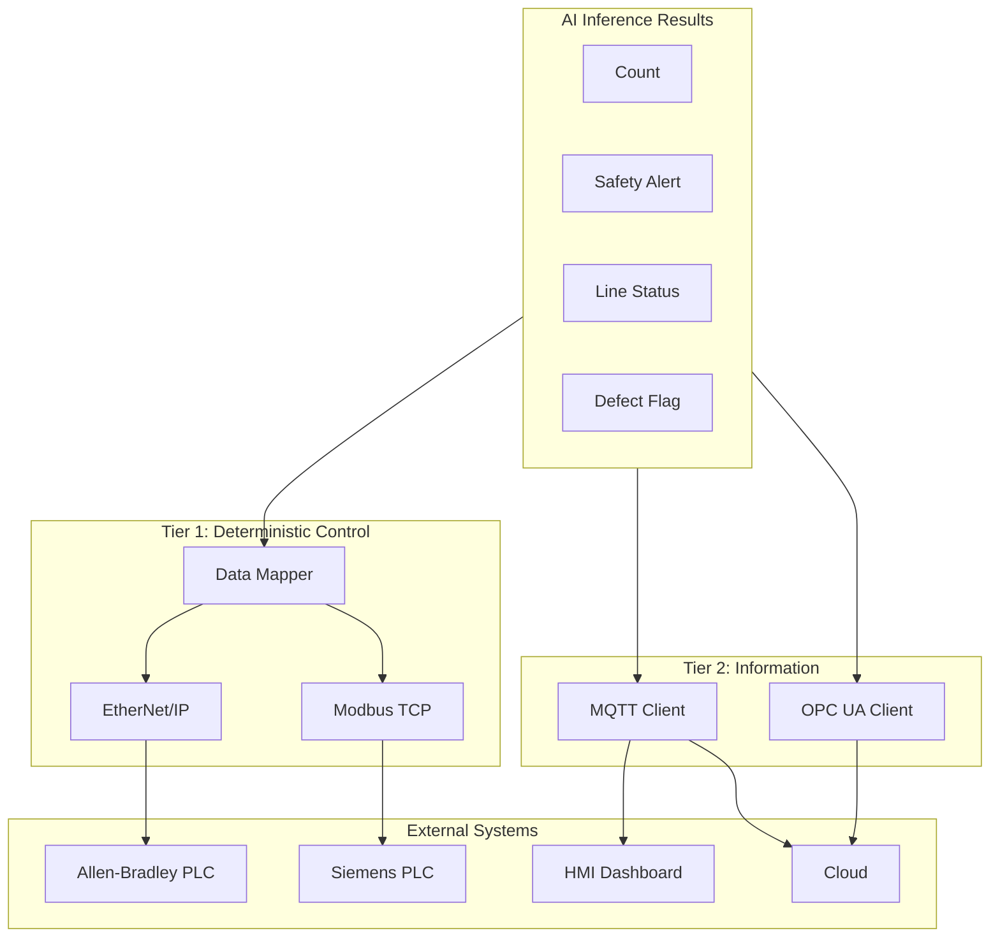
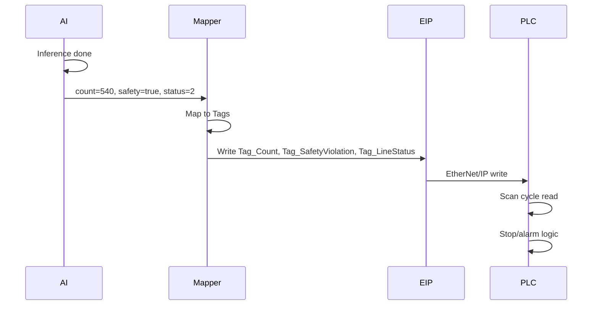

# Layer 6: PLC Integration — High-Level Architecture

## 1. Layer Overview

### 1.1 Role

The PLC Integration Layer **writes AI inference results to factory PLC** for closed-loop control. Camera acts as Server/Adapter. Via EtherNet/IP or Modbus TCP, writes count, safety alert, line status to PLC registers. PLC reads every few ms and stops conveyor, triggers alarm, or rejects.

### 1.2 Design Principles

- **Two-tier**: Tier 1 deterministic (EtherNet/IP, Modbus TCP), Tier 2 information (MQTT, OPC UA)
- **No-code integration**: Memory Map, EDS files for electrician drag-and-drop
- **Standard register layout**: Unified Tag/register semantics for reuse

---

## 2. Architecture Diagram



---

## 3. Core Components

### 3.1 Data Mapper

Maps AI results to PLC registers/Tags.

| AI Output | Type | Modbus Register | EtherNet/IP Tag |
|-----------|------|-----------------|-----------------|
| Count | Int | 40001 | Tag_Count |
| Safety violation | Bool | 40002 | Tag_SafetyViolation |
| Line status | Int | 40003 | Tag_LineStatus (0=normal, 1=warning, 2=stalled) |
| Defect detected | Bool | 40004 | Tag_DefectDetected |

### 3.2 Tier 1: Deterministic Control

| Protocol | Stack | Target | Latency |
|----------|-------|--------|---------|
| EtherNet/IP | OpENer | Allen-Bradley | 10–50ms |
| Modbus TCP | libmodbus | Siemens, AutomationDirect | 10–50ms |

**Notes**:

- Camera as **Adapter** (slave); PLC polls or camera pushes (per protocol)
- Write period: Synced with inference FPS, e.g. 30fps → ~33ms update

### 3.3 Tier 2: Information

| Protocol | Use |
|----------|-----|
| MQTT | Alert images, metadata, efficiency → HMI / cloud |
| OPC UA | Structured data, history, cross-factory analysis |

### 3.4 Memory Map

| Address | Name | Type | Description |
|---------|------|------|-------------|
| 40001 | Count | INT16 | Current count |
| 40002 | SafetyViolation | BOOL | Safety violation (no hard hat, etc.) |
| 40003 | LineStatus | INT16 | 0=normal, 1=warning, 2=stalled |
| 40004 | DefectDetected | BOOL | Defect detected |
| 40005–40010 | Reserved | - | Reserved |

### 3.5 EDS File (EtherNet/IP)

For Allen-Bradley Studio 5000 drag-and-drop integration.

---

## 4. Data Flow



---

## 5. Interface Definition

### 5.1 To upper (algorithm container)

```python
from plc import PLCWriter

writer = PLCWriter(protocol="modbus_tcp", host="192.168.1.10", port=502)
writer.write_count(540)
writer.write_safety_violation(True)
writer.write_line_status(2)  # stalled
```

### 5.2 Config-driven

```yaml
plc:
  protocol: modbus_tcp  # or ethernet_ip
  connection:
    host: 192.168.1.10
    port: 502
  mapping:
    count_register: 40001
    safety_register: 40002
    status_register: 40003
```

---

## 6. Directory Structure

```
06_plc/
├── ethernet_ip/
│   ├── opener/
│   ├── eds/
│   └── adapter.py
├── modbus_tcp/
│   ├── libmodbus/
│   ├── memory_map.md
│   └── adapter.py
├── mqtt/
│   └── client.py
├── opc_ua/
│   └── client.py
├── mapper/
│   └── data_mapper.py
└── README.md
```

---

## 7. Tech Choices

| Dimension | Choice | Reason |
|-----------|--------|--------|
| EtherNet/IP | OpENer | Open source, C, portable |
| Modbus TCP | libmodbus | Mature, stable |
| MQTT | paho-mqtt / Mosquitto | Lightweight, widely supported |
| OPC UA | open62541 / opcua-asyncio | Industrial standard |

---

## 8. Implementation Notes

1. **Connection keepalive**: Auto-reconnect on disconnect, cache unsent data
2. **Write frequency**: Match inference FPS, avoid PLC overload
3. **Safety**: Tier 1 data must align with line safety logic
4. **Timestamps**: Tier 2 data with timestamps for traceability
