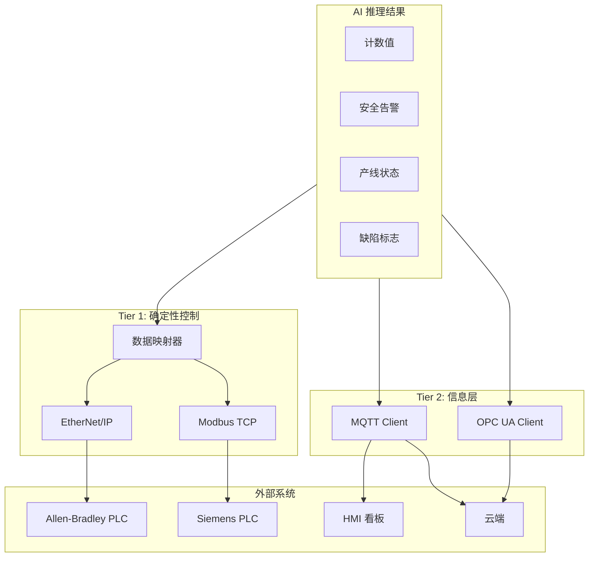
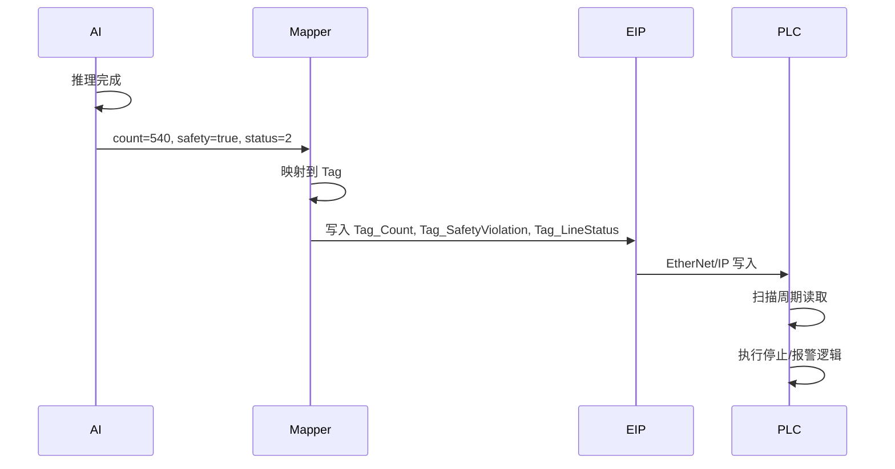

# 第 6 层：PLC 工业控制层 — 高层架构设计

## 1. 层概述

### 1.1 定位

PLC 工业控制层 (PLC Integration Layer) 将 **AI 推理结果写入工厂 PLC**，实现闭环控制。相机作为 Server/Adapter，通过 EtherNet/IP 或 Modbus TCP 将计数、安全告警、产线状态等写入 PLC 寄存器，PLC 每数毫秒读取并执行停止传送带、报警、剔除等动作。

### 1.2 设计原则

- **双层架构**：Tier 1 确定性控制（EtherNet/IP、Modbus TCP），Tier 2 信息层（MQTT、OPC UA）
- **无代码集成**：提供 Memory Map、EDS 文件，工厂电气工程师可拖拽集成
- **标准寄存器布局**：定义统一的 Tag/寄存器语义，便于多场景复用

---

## 2. 架构图



---

## 3. 核心组件

### 3.1 数据映射器 (Data Mapper)

将 AI 结果映射到 PLC 寄存器/Tag。

| AI 输出 | 类型 | 寄存器示例 (Modbus) | EtherNet/IP Tag 示例 |
|---------|------|----------------------|----------------------|
| 当前计数 | Int | 40001 | Tag_Count |
| 安全违规 | Bool | 40002 | Tag_SafetyViolation |
| 产线状态 | Int | 40003 | Tag_LineStatus (0=正常, 1=警告, 2=停滞) |
| 缺陷检测 | Bool | 40004 | Tag_DefectDetected |

### 3.2 Tier 1：确定性控制

| 协议 | 协议栈 | 目标 | 延迟 |
|------|--------|------|------|
| EtherNet/IP | OpENer | Allen-Bradley | 10–50ms |
| Modbus TCP | libmodbus | Siemens、AutomationDirect | 10–50ms |

**实现要点**：

- 相机作为 **Adapter**（从站），PLC 为主站轮询，或相机主动推送（依协议支持）
- 写入周期：与推理帧率同步，如 30fps → 约 33ms 更新一次

### 3.3 Tier 2：信息层

| 协议 | 用途 |
|------|------|
| MQTT | 告警截图、元数据、效率统计 → HMI / 云端 |
| OPC UA | 结构化数据、历史追溯、跨工厂分析 |

### 3.4 Memory Map 文档

供工厂电气工程师参考的寄存器映射表：

| 地址 | 名称 | 类型 | 说明 |
|------|------|------|------|
| 40001 | Count | INT16 | 当前计数值 |
| 40002 | SafetyViolation | BOOL | 安全违规（无安全帽等） |
| 40003 | LineStatus | INT16 | 0=正常, 1=警告, 2=停滞 |
| 40004 | DefectDetected | BOOL | 检测到缺陷 |
| 40005–40010 | Reserved | - | 预留 |

### 3.5 EDS 文件 (EtherNet/IP)

供 Allen-Bradley Studio 5000 使用，实现「拖拽」相机为工业部件。

---

## 4. 数据流



---

## 5. 接口定义

### 5.1 对上层（算法容器）

```python
from plc import PLCWriter

writer = PLCWriter(protocol="modbus_tcp", host="192.168.1.10", port=502)
writer.write_count(540)
writer.write_safety_violation(True)
writer.write_line_status(2)  # 停滞
```

### 5.2 配置驱动

```yaml
plc:
  protocol: modbus_tcp  # or ethernet_ip
  connection:
    host: 192.168.1.10
    port: 502
  mapping:
    count_register: 40001
    safety_register: 40002
    status_register: 40003
```

---

## 6. 目录结构

```
06_plc/
├── ethernet_ip/
│   ├── opener/           # OpENer 集成
│   ├── eds/              # EDS 文件
│   └── adapter.py
├── modbus_tcp/
│   ├── libmodbus/        # libmodbus 集成
│   ├── memory_map.md    # 寄存器映射表
│   └── adapter.py
├── mqtt/
│   └── client.py
├── opc_ua/
│   └── client.py
├── mapper/
│   └── data_mapper.py    # AI 结果 → 寄存器映射
└── README.md
```

---

## 7. 技术选型

| 维度 | 选型 | 理由 |
|------|------|------|
| EtherNet/IP | OpENer | 开源、C 实现、可移植 |
| Modbus TCP | libmodbus | 成熟稳定 |
| MQTT | paho-mqtt / Eclipse Mosquitto | 轻量、广泛支持 |
| OPC UA | open62541 / opcua-asyncio | 工业标准 |

---

## 8. 实现要点

1. **连接保活**：PLC 连接断开时自动重连，并缓存未发送数据
2. **写入频率**：与推理帧率匹配，避免过于频繁写入造成 PLC 负载
3. **安全**：Tier 1 数据需与产线安全逻辑一致，避免误触发
4. **时戳**：Tier 2 数据建议带时戳，便于追溯
