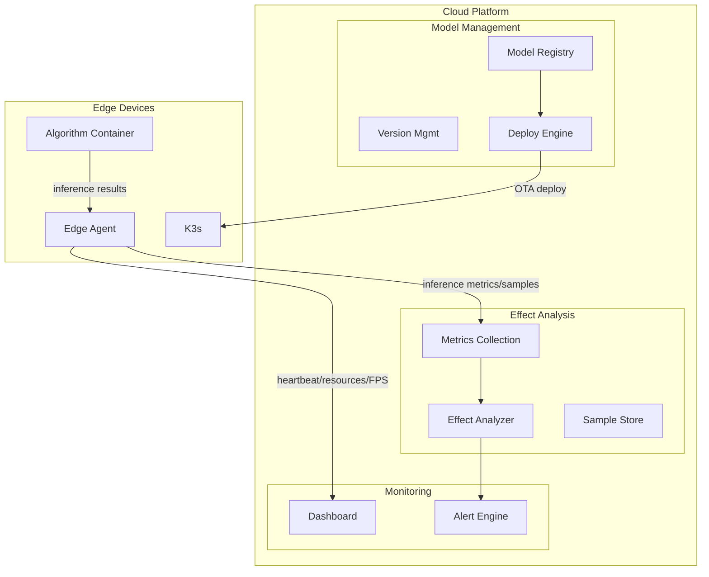
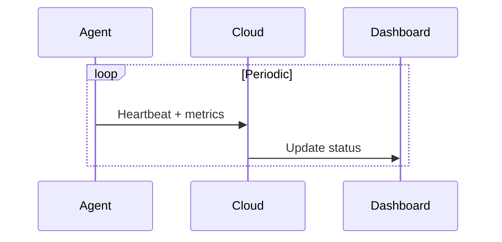
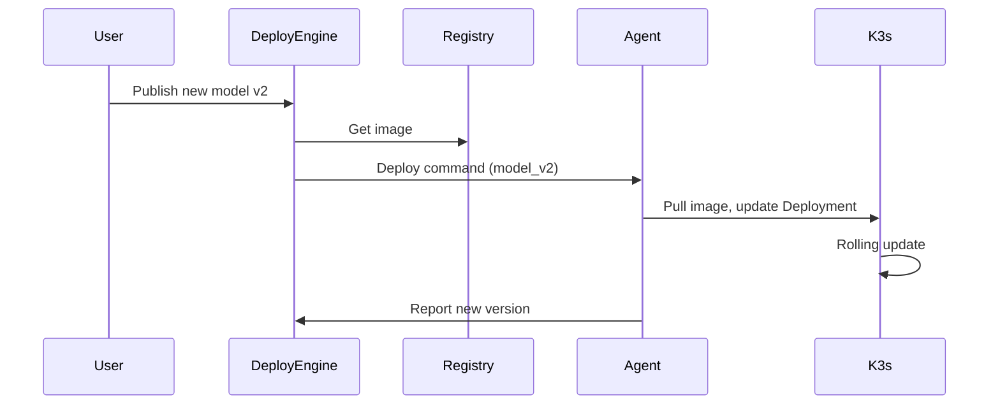
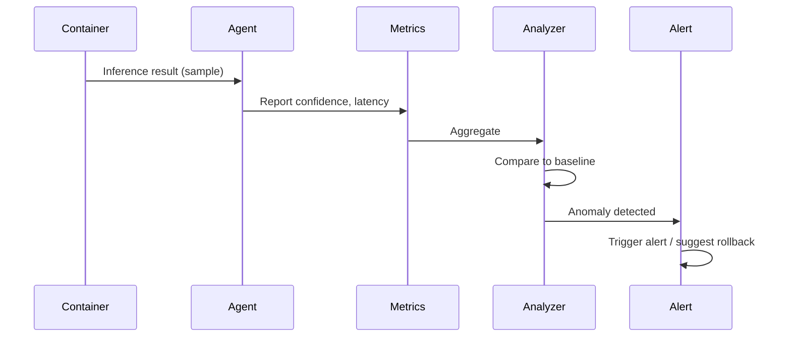

# Layer 7: Cloud Platform — High-Level Architecture

## 1. Layer Overview

### 1.1 Role

The Cloud Platform is the **control center** for edge devices: monitoring, model OTA, effect detection, forming a "train → deploy → monitor → iterate" loop. Customers can upgrade models and verify effect without on-site ops.

### 1.2 Design Principles

- **Lightweight access**: Edge Agent low resource, reports via MQTT/HTTPS
- **Secure and reliable**: Model rollout with signature verification, gray release and rollback
- **Effect loop**: Collect inference metrics and samples, auto-detect anomalies and alert

---

## 2. Architecture Diagram



---

## 3. Core Components

### 3.1 Device Monitoring

| Metric | Collection | Report Freq |
|--------|------------|-------------|
| Online status | Agent heartbeat | 10–30s |
| CPU/memory/temp | Agent collect | 1min |
| Inference FPS | Container stats | 1min |
| PLC connection | Agent query | 1min |
| Current model version | Agent report | On change |

### 3.2 Model OTA

| Step | Component | Description |
|------|-----------|-------------|
| 1. Ingest | Model registry | Upload ONNX/quantized model or Docker image |
| 2. Version | Version mgmt | Tag, associate scene, target hardware |
| 3. Strategy | Deploy engine | Select devices/groups, gray ratio |
| 4. Deploy | Deploy engine | Push to edge, trigger K3s update |
| 5. Verify | Edge Agent | Verify signature, pull, switch |
| 6. Rollback | Deploy engine | One-click rollback to previous |

### 3.3 Effect Monitoring

| Metric | Collection | Alert Logic |
|--------|-------------|-------------|
| Inference latency P50/P99 | Edge report | Exceed threshold (e.g. 50ms) |
| Confidence distribution | Sampled results | Mean drop, outlier increase |
| False/miss rate | Human labels + auto stats | Exceed baseline |
| Device offline | Heartbeat timeout | Immediate alert |

### 3.4 Edge Agent

| Function | Description |
|----------|-------------|
| Heartbeat | Periodic device ID, version, status |
| Metrics collection | System and inference metrics |
| Sample sampling | Proportional inference result upload (anonymized) |
| OTA receive | Receive deploy command, pull model/image and switch |
| Rollback | Receive rollback command, switch to previous |

---

## 4. Data Flow

### 4.1 Monitoring Report



### 4.2 Model Deploy



### 4.3 Effect Detection & Alert



---

## 5. Interface Definition

### 5.1 Edge Agent → Cloud

| Endpoint | Method | Description |
|----------|--------|-------------|
| `/api/v1/heartbeat` | POST | Heartbeat + basic metrics |
| `/api/v1/metrics` | POST | Inference metrics, resource usage |
| `/api/v1/samples` | POST | Inference result samples (optional anonymization) |

### 5.2 Cloud → Edge Agent

| Endpoint | Method | Description |
|----------|--------|-------------|
| `/ota/deploy` | Push / long-poll | Deploy new model/image command |
| `/ota/rollback` | Push | Rollback command |

### 5.3 Management API

| Endpoint | Description |
|----------|-------------|
| `GET /devices` | Device list and status |
| `POST /models` | Upload model |
| `POST /deploy` | Initiate deploy |
| `POST /rollback` | Initiate rollback |
| `GET /effects/{device_id}` | Effect metrics |

---

## 6. Directory Structure

```
07_cloud/
├── agent/
│   ├── main.py
│   ├── collector.py
│   └── ota_client.py
├── backend/
│   ├── api/
│   ├── deploy/
│   ├── monitor/
│   └── effect/
├── dashboard/
│   └── grafana/
└── README.md
```

---

## 7. Tech Choices

| Dimension | Choice | Reason |
|-----------|--------|--------|
| Device access | MQTT / HTTPS | MQTT lightweight for edge, HTTPS general |
| Model registry | Harbor / self-hosted | Store images and model files |
| Deploy | Self-built / Argo CD | K3s GitOps support |
| Monitoring | Prometheus + Grafana | Metrics and visualization |
| Effect analysis | Self-built / MLflow | Model version and metrics |

---

## 8. Implementation Notes

1. **Security**: Model/image signature verification
2. **Gray release**: By device group, ratio
3. **Rollback**: Keep previous version, one-click rollback
4. **Sampling**: Inference sample upload, control bandwidth and privacy
5. **Offline**: Cache metrics when edge is offline, backfill on reconnect
