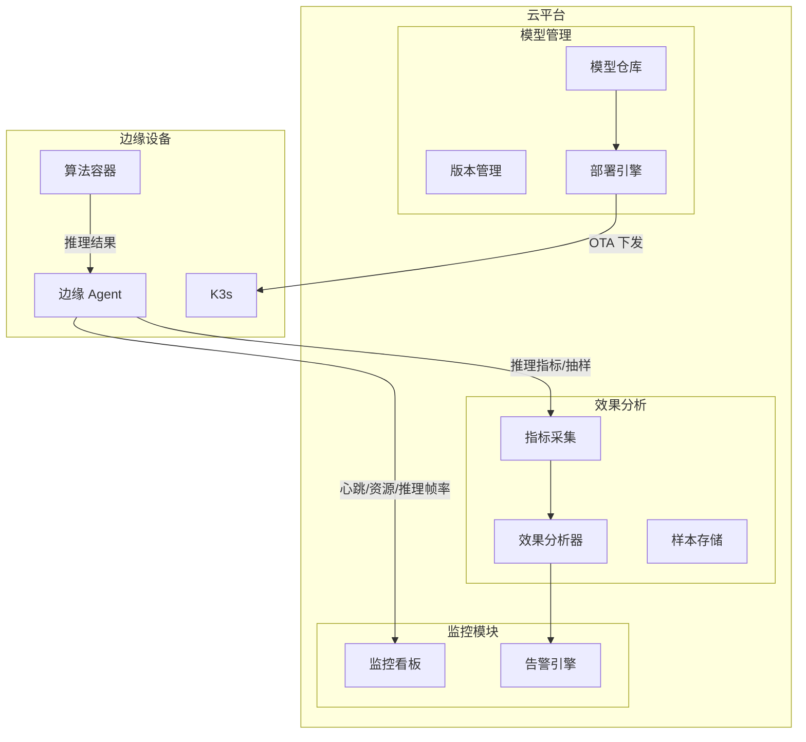
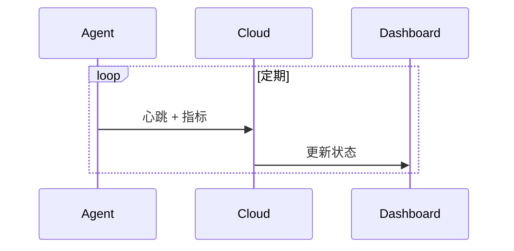
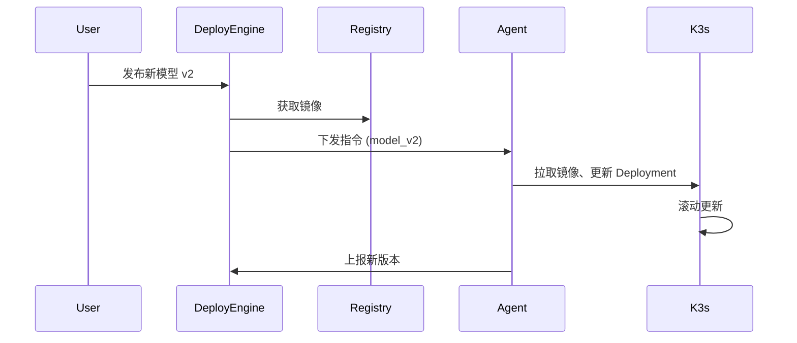
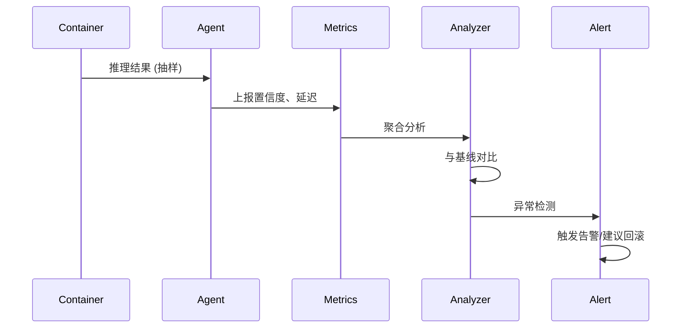

# 第 7 层：云平台监控与管理 — 高层架构设计

## 1. 层概述

### 1.1 定位

云平台监控与管理层 (Cloud Platform) 是边缘设备的**管控中枢**，实现设备监控、模型自动下发、效果自动检测，形成「训练 → 部署 → 监控 → 迭代」的闭环。客户无需现场运维即可完成模型升级与效果验证。

### 1.2 设计原则

- **轻量接入**：边缘 Agent 占用资源少，通过 MQTT/HTTPS 上报
- **安全可靠**：模型下发需校验签名，支持灰度与回滚
- **效果闭环**：采集推理指标与样本，自动检测异常并告警

---

## 2. 架构图



---

## 3. 核心组件

### 3.1 设备监控 (Device Monitoring)

| 指标类型 | 采集方式 | 上报频率 |
|----------|----------|----------|
| 在线状态 | Agent 心跳 | 10–30s |
| CPU/内存/温度 | Agent 采集 | 1min |
| 推理帧率 | 容器内统计 | 1min |
| PLC 连接状态 | Agent 查询 | 1min |
| 当前模型版本 | Agent 上报 | 变更时 |

### 3.2 模型自动下发 (Model OTA)

| 步骤 | 组件 | 说明 |
|------|------|------|
| 1. 入库 | 模型仓库 | 上传 ONNX/量化后模型或 Docker 镜像 |
| 2. 版本 | 版本管理 | 打 tag，关联场景、目标硬件 |
| 3. 策略 | 部署引擎 | 选择设备/设备组，灰度比例 |
| 4. 下发 | 部署引擎 | 推送至边缘，触发 K3s 更新 |
| 5. 校验 | 边缘 Agent | 校验签名、拉取、切换 |
| 6. 回滚 | 部署引擎 | 一键回滚至上一版本 |

### 3.3 效果自动检测 (Effect Monitoring)

| 指标 | 采集方式 | 告警逻辑 |
|------|----------|----------|
| 推理延迟 P50/P99 | 边缘上报 | 超过阈值（如 50ms）告警 |
| 置信度分布 | 抽样上报检测结果 | 均值骤降、异常值增多 |
| 误检/漏检率 | 人工标注 + 自动统计 | 超过基线告警 |
| 设备离线 | 心跳超时 | 立即告警 |

### 3.4 边缘 Agent

| 功能 | 说明 |
|------|------|
| 心跳 | 定期上报设备 ID、版本、状态 |
| 指标采集 | 采集系统与推理指标 |
| 样本抽样 | 按比例上报推理结果（脱敏） |
| 接收 OTA | 接收部署指令，拉取模型/镜像并切换 |
| 回滚 | 接收回滚指令，切换至上一版本 |

---

## 4. 数据流

### 4.1 监控上报



### 4.2 模型下发



### 4.3 效果检测与告警



---

## 5. 接口定义

### 5.1 边缘 Agent → 云平台

| 接口 | 方法 | 说明 |
|------|------|------|
| `/api/v1/heartbeat` | POST | 心跳 + 基础指标 |
| `/api/v1/metrics` | POST | 推理指标、资源占用 |
| `/api/v1/samples` | POST | 推理结果抽样（可选脱敏） |

### 5.2 云平台 → 边缘 Agent

| 接口 | 方法 | 说明 |
|------|------|------|
| `/ota/deploy` | 推送 / 长轮询 | 下发新模型/镜像指令 |
| `/ota/rollback` | 推送 | 回滚指令 |

### 5.3 管理端 API

| 接口 | 说明 |
|------|------|
| `GET /devices` | 设备列表及状态 |
| `POST /models` | 上传模型 |
| `POST /deploy` | 发起部署 |
| `POST /rollback` | 发起回滚 |
| `GET /effects/{device_id}` | 效果指标 |

---

## 6. 目录结构

```
07_cloud/
├── agent/                 # 边缘 Agent
│   ├── main.py
│   ├── collector.py       # 指标采集
│   └── ota_client.py      # OTA 客户端
├── backend/               # 云平台后端
│   ├── api/
│   ├── deploy/
│   ├── monitor/
│   └── effect/
├── dashboard/             # 监控看板
│   └── grafana/
└── README.md
```

---

## 7. 技术选型

| 维度 | 选型 | 理由 |
|------|------|------|
| 设备接入 | MQTT / HTTPS | MQTT 轻量适合边缘，HTTPS 通用 |
| 模型仓库 | Harbor / 自建 | 存储镜像与模型文件 |
| 部署 | 自研 / Argo CD | 支持 K3s GitOps |
| 监控 | Prometheus + Grafana | 指标采集与可视化 |
| 效果分析 | 自研 / MLflow | 模型版本与指标关联 |

---

## 8. 实现要点

1. **安全**：模型/镜像需签名校验，防止篡改
2. **灰度**：支持按设备组、比例灰度发布
3. **回滚**：保留上一版本，支持一键回滚
4. **采样**：推理样本抽样上报，控制带宽与隐私
5. **离线**：边缘断网时缓存指标，恢复后补传
