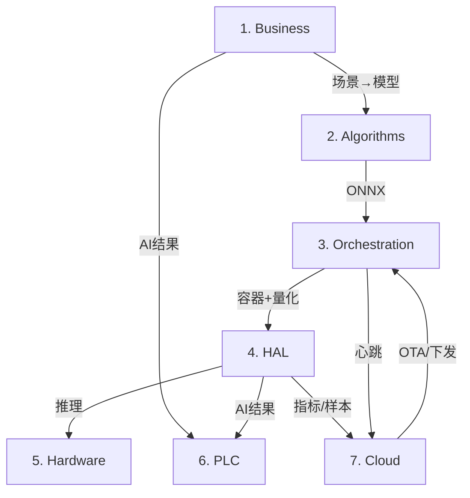

# 可配置工业相机解决方案 — 分层架构设计

本目录包含各层技术的**详细高层架构设计**，供工程团队实现参考。

## 文档索引

| 层级 | 文档 | 核心职责 |
|------|------|----------|
| 1 | [01_business_layer.md](01_business_layer.md) | 场景配置、场景路由、算法选择 |
| 2 | [02_algorithms_layer.md](02_algorithms_layer.md) | 模型仓库、算法模块、ONNX 管理 |
| 3 | [03_orchestration_layer.md](03_orchestration_layer.md) | Docker、K3s、量化流水线 |
| 4 | [04_hal_layer.md](04_hal_layer.md) | 统一感知 API、厂商适配器、ISP |
| 5 | [05_hardware_layer.md](05_hardware_layer.md) | 平台能力、BSP 配置 |
| 6 | [06_plc_layer.md](06_plc_layer.md) | EtherNet/IP、Modbus TCP、MQTT、OPC UA |
| 7 | [07_cloud_platform.md](07_cloud_platform.md) | 设备监控、模型自动下发、效果自动检测 |

## 层间关系

## 各层设计要点

| 层 | 设计要点 |
|----|----------|
| Business | 声明式配置、场景与算法解耦、PLC 映射可配置 |
| Algorithms | 框架中立、ONNX 为主、元数据可追溯 |
| Orchestration | 一次构建多端部署、K3s 輕量化、量化自动化 |
| HAL | 统一 API、运行时选型、适配器可扩展 |
| Hardware | 能力声明、配置驱动 |
| PLC | 双层架构、Memory Map、EDS 支持 |
| Cloud | 设备监控、模型 OTA、效果闭环 |
