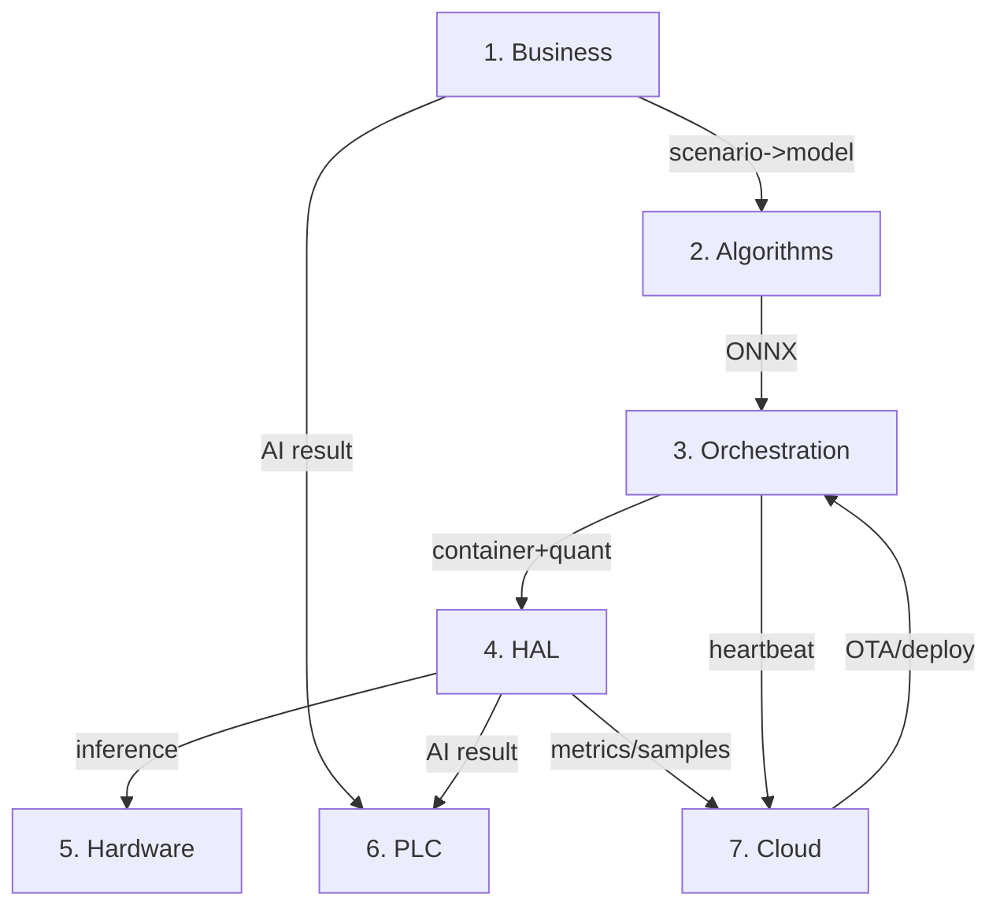

# Configurable Industrial Camera Solution — Layered Architecture Design

This directory contains **detailed high-level architecture** for each layer, for engineering implementation reference.

## Document Index

| Layer | Document | Core Responsibility |
|-------|----------|---------------------|
| 1 | [01_business_layer.md](01_business_layer.md) | Scene config, scene routing, algorithm selection |
| 2 | [02_algorithms_layer.md](02_algorithms_layer.md) | Model repository, algorithm modules, ONNX management |
| 3 | [03_orchestration_layer.md](03_orchestration_layer.md) | Docker, K3s, quantization pipeline |
| 4 | [04_hal_layer.md](04_hal_layer.md) | Unified perception API, vendor adapters, ISP |
| 5 | [05_hardware_layer.md](05_hardware_layer.md) | Platform capability, BSP config |
| 6 | [06_plc_layer.md](06_plc_layer.md) | EtherNet/IP, Modbus TCP, MQTT, OPC UA |
| 7 | [07_cloud_platform.md](07_cloud_platform.md) | Device monitoring, model OTA, effect detection |

## Layer Relationships

## Design Highlights by Layer

| Layer | Design Highlights |
|-------|-------------------|
| Business | Declarative config, scenario-algorithm decoupling, PLC mapping configurable |
| Algorithms | Framework-agnostic, ONNX primary, metadata traceable |
| Orchestration | Build once deploy everywhere, K3s lightweight, quantization automated |
| HAL | Unified API, runtime selection, adapter extensible |
| Hardware | Capability declaration, config-driven |
| PLC | Two-tier architecture, Memory Map, EDS support |
| Cloud | Device monitoring, model OTA, effect loop |
