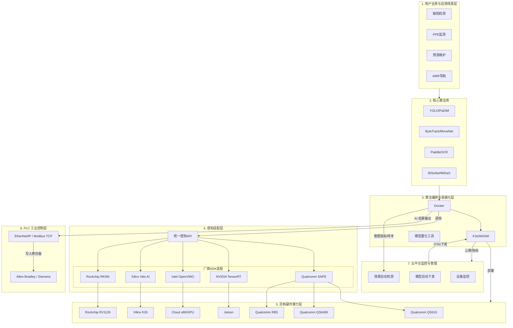
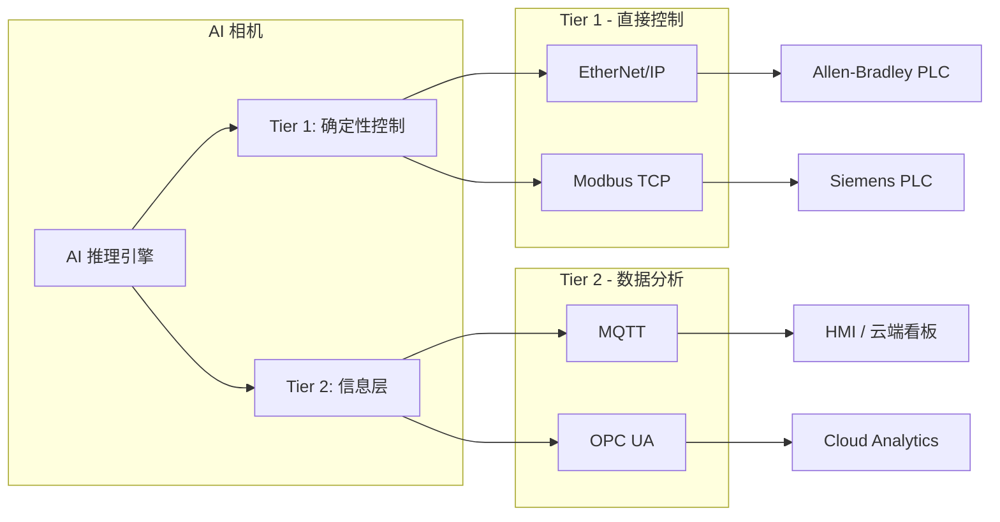
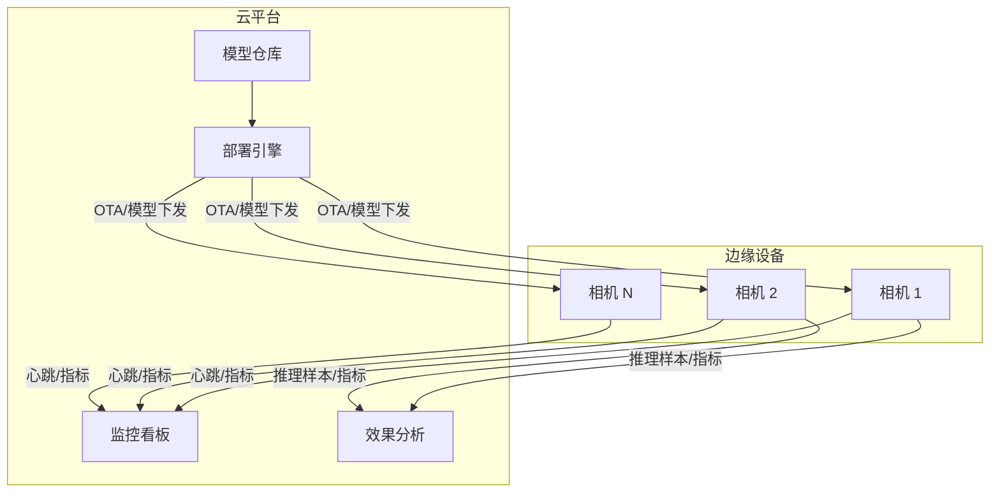

# 可配置工业相机解决方案

> 软件定义相机 (Software-Defined Camera) · 工业 4.0 自适应部署平台

---

## 一、执行摘要 (Executive Summary)

### 产品一句话

**可配置的工业视觉自适应部署平台，实现「一次开发、多端部署」。**

### 核心痛点

- **场景碎片化**：北美 SMB 工厂需求各异——安全防护 (PPE)、流水线工件计数、具身智能抓取——传统方案需为每种场景单独定制
- **硬件绑定过紧**：算法与高通 / 英伟达 / 英特尔等硬件深度耦合，换硬件即需重写推理逻辑
- **部署成本高**：现场调参、模型重训、多厂商 SDK 维护，导致交付周期长、人力成本高
- **与 PLC 脱节**：AI 相机与工厂现有 Allen-Bradley、Siemens 等 PLC 无法直接通讯，需额外网关或定制开发

### 解决方案

通过 **感知适配层 (Perception Adapter Layer)** 与 **算法容器化 (Algorithm Containerization)**，实现：

- **按场景选算法**：客户只需定义「检测什么」，无需关心底层算力
- **按算力选硬件**：同一模型可部署到高通 QS610/QS6490/RB5、Jetson、Xilinx K26、Rockchip RV1126、云端 x86/GPU
- **PLC 即插即用**：相机作为标准工业传感器，通过 EtherNet/IP 或 Modbus TCP 直接写入 PLC 寄存器，实现闭环控制
- **云平台管控**：统一监控设备状态、自动下发新模型、自动检测模型效果，支持远程 OTA 与效果闭环

### 目标市场

- 北美 SMB 工厂（缺陷检测、安全防护 PPE、预测性维护、AMR/AGV 导航）
- 具身智能与机器人抓取
- 跨工厂长周期数据分析

---

## 二、产品愿景与价值主张

### 愿景

成为工业 4.0 时代的 **「软件定义相机」标准平台**，让工业视觉像云计算一样可配置、可编排、可迁移。

### 价值主张

| 维度 | 传统方案 | 本方案 |
|------|----------|--------|
| 客户视角 | 需了解硬件品牌、SDK 差异 | 只关心「能否检测安全帽 / 工件 / 缺陷」 |
| 算法部署 | 换硬件需重写推理代码 | 同一模型可部署到高通、Jetson、Xilinx K26、Rockchip RV1126 等 |
| 迭代速度 | 现场调参、手动更新 | 容器化编排，支持远程 OTA 更新 |
| PLC 集成 | 需额外网关、定制开发 | 相机即插即用，直接写入 PLC 寄存器，闭环控制 |
| 模型迭代 | 现场手动更新、效果难验证 | 云平台自动下发、效果自动检测、远程 OTA |

---

## 三、技术架构

### 3.1 架构总览

该架构采用分层设计，核心在于 **感知适配层** 和 **算法编排层**，实现算法逻辑与底层算力的完全分离。

### 3.2 层级深度解读

#### 第 1 层：用户业务与应用场景层 (Business Layer)

**定义**：客户到底需要什么。

**自适应逻辑**：客户不在乎硬件是高通还是英伟达。他们在乎的是「我需要检测工人没戴安全帽（场景 A）」。业务层将这种需求转化为对特定 AI 模型（如 YOLO）的调用请求。

#### 第 2 层：核心算法库 (Core AI Model Library)

**定义**：算法武器库，保持框架中立 (Framework Agnostic)。

**自适应逻辑**：模型（如 ONNX 格式的 YOLOv8）不包含任何特定硬件的优化代码。它们是纯粹的数学逻辑，可快速重新训练以适应新场景（例如，从检测安全帽改为检测纸箱缺陷）。

**典型组件**：YOLO/PaDiM/PatchCore（检测/异常）、ByteTrack/MoveNet（追踪/姿态）、PaddleOCR（识别）、BiSeNet/MiDaS（分割/深度）、1D-CNN/CRNN（音频预测）。

#### 第 3 层：算法编排与容器化层 (Orchestration Layer)

**定义**：实现快速布置的关键。

**自适应逻辑**：Docker 容器将算法库、依赖环境（OpenCV 等）打包。利用 **Model Quantization（模型量化）** 工具，在打包前针对目标硬件进行 INT8 量化——若部署到高通 QCS，则量化为符合 SNPE 要求的格式；若部署到 NVIDIA，则量化为符合 TensorRT 要求的格式。

**编排管理 (K3s)**：根据硬件算力和网络状况，决定容器跑在相机内、边缘网关内，还是云端。

#### 第 4 层：感知适配层 (Perception Adapter Layer) —— 核心资产

**定义**：整个系统实现「解耦」的灵魂所在。

**统一感知 API**：定义一套标准接口（C++ 或 Python）。对于上层算法容器，图像输入、推理启动、I/O 控制接口均一致。

**厂商 SDK 适配器**：当算法容器发出推理请求时，感知 API 自动识别底层硬件——Qualcomm (QS610/QS6490/RB5) 映射到 SNPE/QNN；NVIDIA Jetson 映射到 TensorRT；Intel 映射到 OpenVINO；Xilinx K26 映射到 Vitis AI；Rockchip 映射到 RKNN。

**专家视角 ISP 调优**：针对不同厂商 ISP 的调优驱动，确保在北美工厂复杂光影下，不同相机的成像质量一致。

#### 第 5 层：异构硬件算力层 (Physical Hardware Layer)

**定义**：最终执行任务的物理设备。

| 硬件平台 | 适用场景 | 特点 | 感知适配器 |
|----------|----------|------|------------|
| Qualcomm QS610 | 轻量级 Smart Camera | 低功耗、紧凑型、入门级边缘推理 | SNPE |
| Qualcomm QS6490 | 高性能 Smart Camera | 多路相机、高吞吐量、工业级 | SNPE |
| Qualcomm RB5 | 边缘 AI 开发板 | DSP 加速、多路输入、音频处理、ISP 调优 | SNPE |
| NVIDIA Jetson | L3 具身智能 | 多路相机、离线大模型、高算力 | TensorRT |
| Rockchip RV1126 | 轻量级 Smart Camera、国产化 | NPU 加速、RKNN、低功耗、成本敏感 | RKNN |
| Xilinx K26 (Kria) | 工业视觉、超低延迟 | DPU 加速、Vitis AI、可编程逻辑、工业级 | Vitis AI |
| Cloud Server (x86/GPU) | 跨工厂分析 | 长周期数据分析、大规模再训练 | OpenVINO / TensorRT |

#### 第 6 层：PLC 工业控制层 (PLC Integration Layer)

**定义**：将 AI 推理结果写入工厂 PLC，实现闭环控制。

**核心逻辑**：相机作为 Server/Adapter，通过 EtherNet/IP 或 Modbus TCP 将计数、安全告警、产线状态等写入 PLC 寄存器。PLC 每数毫秒读取，可立即停止传送带、触发报警或执行剔除。

**详见**：[五、PLC 集成策略](#五plc-集成策略工业现场控制层)

#### 第 7 层：云平台监控与管理 (Cloud Platform)

**定义**：统一监控边缘设备、自动下发新模型、自动检测模型效果，实现远程 OTA 与效果闭环。

**核心能力**：设备状态监控、模型版本管理、自动部署、效果指标采集与告警。

**详见**：[六、云平台监控与管理](#六云平台监控与管理)

---

## 四、智能工厂核心场景与 AI 模型

### 4.1 场景一：工业质检与缺陷检测 (Defect Detection)

**业务价值**：智能工厂最「吸金」的场景。通过摄像头实时扫描传送带上的零件，识别表面划痕、裂纹或组装缺失，实现毫秒级实时剔除。

| 模型类型 | 推荐模型 | 格式 | 说明 |
|----------|----------|------|------|
| 目标检测 | YOLOv8/v10 (Tiny/Nano) | TFLite / DLC | Tiny 版本在 RB5 上跑得飞快，开源预训练权重丰富 |
| 目标检测 | MobileNet-SSD | DLC | 轻量级，适合低功耗部署 |
| 异常检测 (无监督) | PaDiM / PatchCore | ONNX | 只需训练「合格品」，即可识别所有不符合特征的「次品」 |

**高通 RB5 优势**：利用 `qtimltflite` 插件配合 DSP 委托，可实现毫秒级实时剔除动作。

**推荐硬件**：QS610（单路）、QS6490（多路）、RB5（开发验证）、Xilinx K26（工业级、超低延迟）、Rockchip RV1126（国产化、低成本）。

---

### 4.2 场景二：安全生产与行为分析 (Safety & PPE Monitoring)

**业务价值**：监控工人是否佩戴安全帽、反光背心，或是否进入叉车作业禁区；检测跌倒或违规操作。

| 模型类型 | 推荐模型 | 格式 | 说明 |
|----------|----------|------|------|
| 姿态估计 | MoveNet / MoveNet.Thunder | TFLite | 检测人体关键点，判断跌倒或违规操作 |
| 目标检测/分类 | YOLO 变体（安全帽/工作服） | DLC | 专门训练的 PPE 检测模型 |
| 目标检测 | SSD-MobileNet | DLC | 性能稳健，适合展示 RB5 在低功耗下的高吞吐量 |

**高通 RB5 优势**：支持多路摄像头输入（`qtiqmmfsrc` 可开启多个流），一台 RB5 即可监控多个工位。

**推荐硬件**：QS6490（多工位）、RB5（多路验证）。

---

### 4.3 场景三：预测性维护 (Predictive Maintenance)

**业务价值**：通过麦克风监听电机运转声，预测轴承是否即将损坏；结合视觉检测设备异常。

| 模型类型 | 推荐模型 | 说明 |
|----------|----------|------|
| 一维卷积 | 1D-CNN | 处理时序音频数据 |
| 时序+频谱 | CRNN | CNN 提取频谱特征 + RNN 处理时序演变 |

**高通 RB5 优势**：RB5 拥有极强的数字信号处理（DSP）能力，处理音频特征提取效率远高于传统 CPU。

**推荐硬件**：RB5（DSP 优势）、Jetson（多模态融合）。

---

### 4.4 场景四：物流搬运与 AMR/AGV 导航

**业务价值**：在自动化仓库中，边缘设备作为机器人的「大脑」，负责 SLAM 建图和避障。

| 模型类型 | 推荐模型 | 说明 |
|----------|----------|------|
| 语义分割 | BiSeNetV2 / MobileNetV3-Segmentation | 区分地面、障碍物和人 |
| 深度估计 | MiDaS | 无激光雷达时，通过单目摄像头估算距离 |

**高通 RB5 优势**：高度集成的 ISP 能够处理动态范围（HDR）极大的光影变化（如从室内开向仓库门外）。

**推荐硬件**：RB5（ISP/HDR）、Jetson（复杂 SLAM）、Xilinx K26（超低延迟避障、工业级）。

---

### 4.5 场景与硬件选型总览

| 场景 | 典型需求 | 推荐硬件 | 算法组合 |
|------|----------|----------|----------|
| 工业质检与缺陷检测 | 毫秒级剔除、表面缺陷 | QS610 / QS6490 / RB5 / Xilinx K26 / RV1126 | YOLOv8-Nano、PaDiM、PatchCore |
| 安全生产 PPE 监测 | 多工位、低功耗 | QS6490 / RB5 | MoveNet、SSD-MobileNet、YOLO |
| 预测性维护 | 音频+视觉、DSP | RB5 / Jetson | 1D-CNN、CRNN |
| 物流 AMR/AGV 导航 | HDR、SLAM、避障 | RB5 / Jetson / Xilinx K26 | BiSeNetV2、MiDaS |
| 具身智能抓取 | 多模态、大模型 | Jetson + 云端 | 离线 VLM + 检测 |
| 跨工厂数据分析 | 长周期、大规模 | 云端 | 再训练 + 批量推理 |

---

### 4.6 经理实战建议：Demo 模型选型优先级

| 优先级 | 场景 | 推荐模型 | 格式 | 理由 |
|--------|------|----------|------|------|
| **P0（最推荐）** | 零件计件 / 缺陷检测 | YOLOv8-Nano | TFLite | 部署最快，视觉效果最直观，开源预训练权重丰富 |
| **P1** | 安全帽监测 | SSD-MobileNet | DLC | 性能稳健，适合展示 RB5 在低功耗下的高吞吐量 |

---

## 五、PLC 集成策略（工业现场控制层）

工业应用必须与 PLC 深度集成。相机作为 **White-Label Industrial AI Camera**，需「说」北美工厂主流 PLC 的语言，实现 AI 结果到产线控制的闭环。

### 5.1 北美工业标准

| 优先级 | PLC 品牌 | 协议 | 目标市场 |
|--------|----------|------|----------|
| **主攻** | Allen-Bradley (Rockwell Automation) | EtherNet/IP | 北美 SMB 主流 |
| **备选** | Siemens / AutomationDirect | Modbus TCP、Profinet | 欧洲、混合产线 |

### 5.2 双层通信架构 (Two-Tier)

| 层级 | 协议 | 功能 | 数据示例 |
|------|------|------|----------|
| **Tier 1：确定性控制** | EtherNet/IP、Modbus TCP | 相机作为 Server/Adapter，将 AI 结果写入 PLC 寄存器 | Tag_01 (Int)：当前计数 540；Tag_02 (Bool)：安全违规 TRUE；Tag_03 (Int)：产线状态 2（停滞） |
| **Tier 2：信息层** | MQTT、OPC UA | 元数据、证据图像、效率统计上传 HMI 或云端 | 告警截图、日/周效率报表、设备 OEE |

**闭环逻辑**：PLC 每数毫秒读取相机写入的 Tag，可立即停止传送带、触发声光报警或执行剔除动作。

### 5.3 技术实现路线图

| 组件 | 任务 | 说明 |
|------|------|------|
| **协议栈** | 在相机 Linux OS 上集成 EtherNet/IP 或 Modbus TCP 协议栈 | 开源方案：OpENer (EtherNet/IP)、libmodbus (Modbus TCP) |
| **数据映射** | 编写 Memory Map 文档 | 明确告知工厂电气工程师「安全告警位」「计数值」等所在寄存器地址 |
| **EDS 文件 (可选/Pro)** | 开发 Electronic Data Sheet | 北美工程师可在 Rockwell Studio 5000 中「拖拽」相机，如同标准工业部件 |

### 5.4 AI 相机与 PLC 连接方式对比

| 方式 | 延迟 | 复杂度 | 硬件要求 | 适用场景 |
|------|------|--------|----------|----------|
| Digital I/O | < 1ms | 低 | GPIO 直连 PLC 输入 | 急停、简单触发 |
| Modbus TCP | 10–50ms | 中 | 以太网线 | 计数、状态监控 |
| EtherNet/IP | 10–50ms | 高 | 以太网线 | 北美 SMB 标准 |
| MQTT | 100ms+ | 低 | 以太网/云端 | 分析、远程看板 |

### 5.5 北美 SMB 销售价值主张

| 卖点 | 话术 |
|------|------|
| **无代码集成** | 相机在 PLC 环境中以标准传感器身份出现，无需编程 |
| **零硬件改造** | 无需停产安装新接近开关，只需挂载相机并接一根网线 |
| **闭环安全** | 相机不仅「看」，还能主动通知 PLC 关闭设备（如工人进入危险区域） |

---

## 六、云平台监控与管理

云平台是边缘设备的**管控中枢**，实现设备监控、模型自动下发、效果自动检测，形成「训练 → 部署 → 监控 → 迭代」的闭环。

### 6.1 核心能力

| 能力 | 说明 |
|------|------|
| **设备监控** | 设备在线状态、CPU/内存/温度、推理帧率、PLC 连接状态 |
| **模型自动下发** | 新模型通过云平台推送，边缘设备自动拉取并切换，支持灰度发布 |
| **效果自动检测** | 采集推理置信度分布、误检/漏检样本、关键指标趋势，自动告警 |
| **远程 OTA** | 场景配置、模型版本、业务参数远程更新，无需现场运维 |

### 6.2 架构示意

### 6.3 模型自动下发流程

| 步骤 | 说明 |
|------|------|
| 1. 模型入库 | 新模型（ONNX/量化后）上传至云平台模型仓库 |
| 2. 版本管理 | 为模型打版本标签，关联场景、目标硬件 |
| 3. 发布策略 | 选择目标设备/设备组，支持全量或灰度发布 |
| 4. 下发执行 | 边缘设备拉取镜像或模型文件，校验后切换 |
| 5. 回滚 | 效果异常时一键回滚至上一版本 |

### 6.4 效果自动检测

| 指标类型 | 采集方式 | 告警条件 |
|----------|----------|----------|
| 推理延迟 | 边缘上报 P50/P99 | 超过阈值（如 50ms） |
| 置信度分布 | 抽样上报检测结果 | 均值骤降、异常值增多 |
| 误检/漏检 | 人工标注反馈 + 自动统计 | 超过基线 |
| 设备健康 | 心跳、资源占用 | 离线、CPU/内存异常 |

### 6.5 技术选型建议

| 组件 | 选型 | 说明 |
|------|------|------|
| 设备接入 | MQTT / 自定义 Agent | 轻量、适合边缘 |
| 模型仓库 | Harbor / 自建 Registry | 存储 Docker 镜像与模型文件 |
| 部署编排 | 自研 / Argo CD | 支持 K3s 集群的 GitOps |
| 监控 | Prometheus + Grafana | 指标采集与可视化 |
| 效果分析 | 自研 / MLflow | 模型版本与指标关联 |

---

## 七、技术执行清单（技术负责人行动项）

| 优先级 | 任务 | 说明 |
|--------|------|------|
| P0 | 定义统一感知 API 规范 | 确定 AI 容器与底层通讯的标准接口，如 `infer(image_raw, model_id)` |
| P0 | 构建多平台适配器原型 | 采购高通 RB5、QS610/QS6490、Jetson、Xilinx K26、Rockchip RV1126 开发板，实现同一标准模型（如 YOLOv8n）通过统一 API 在多平台上成功运行 |
| P1 | 开发模型优化自动化工具 | PC 端工具流：输入 ONNX 模型，自动生成 SNPE DLC、TensorRT Engine、Vitis AI (K26)、RKNN 模型，并打包进不同 Docker 镜像 |
| P1 | ISP 调优驱动 | 针对不同厂商相机在复杂光影下的成像一致性 |
| P1 | PLC 协议栈集成 | 集成 OpENer (EtherNet/IP) 或 libmodbus，实现 AI 结果写入 PLC 寄存器 |
| P1 | 云平台设备监控 | 边缘 Agent 上报心跳与指标，云平台展示设备状态、推理帧率、资源占用 |
| P2 | 模型自动下发 | 云平台模型仓库 + 部署引擎，支持 OTA 下发新模型至边缘设备 |
| P2 | 效果自动检测 | 采集推理指标、置信度分布，异常时告警并支持回滚 |
| P2 | 编写 Memory Map / EDS 文件 | 提供 Modbus 寄存器映射表或 Allen-Bradley EDS，支持「拖拽式」集成 |

---

## 八、差异化优势与竞争壁垒

| 优势 | 说明 |
|------|------|
| **算法与硬件解耦** | 业界多数方案仍绑定单一厂商，本方案支持多硬件无缝切换 |
| **容器化编排** | K3s/WASM 輕量化，适合边缘部署，支持远程 OTA |
| **统一感知 API** | 降低算法开发者接入成本，一次开发、多端部署 |
| **多厂商适配** | Qualcomm (QS610/QS6490/RB5) SNPE、NVIDIA TensorRT、Intel OpenVINO、Xilinx K26 Vitis AI、Rockchip RV1126 RKNN 全覆盖 |
| **PLC 即插即用** | 支持 EtherNet/IP、Modbus TCP，相机作为标准传感器接入 Allen-Bradley、Siemens 等 PLC |
| **云平台管控** | 设备监控、模型自动下发、效果自动检测，形成训练-部署-监控-迭代闭环 |

---

## 九、商业模式与里程碑

### 商业模式（可选方向）

- **按部署量收费**：每台相机 / 每路视频流按月或按年收费
- **按算法订阅收费**：PPE 检测、工件计数、缺陷检测等按场景订阅

### MVP 里程碑

1. **多平台适配器原型**：高通 RB5 / QS610 + Jetson + Xilinx K26 + Rockchip RV1126 通过统一 API 运行 YOLOv8n
2. **单场景 Demo**：PPE 检测或工件计数完整闭环
3. **量化流水线**：ONNX → SNPE/TensorRT/Vitis AI/RKNN 自动化工具上线
4. **PLC 集成 Demo**：与 Allen-Bradley 或 Modbus PLC 完成首次「AI 结果 → 寄存器」闭环验证
5. **云平台 MVP**：设备监控看板 + 模型 OTA 下发 + 基础效果指标采集

### 建议下一步

- **Sample EDS File**：为工程团队提供 Allen-Bradley 兼容的 EDS 模板，支持 Studio 5000 拖拽集成
- **Modbus Register Map 模板**：定义标准寄存器布局（计数、安全告警、产线状态等），作为相机与 PLC 首次通讯的蓝图

---

## 附录：支持硬件平台一览

| 平台 | 型号示例 | 推理引擎 | 典型应用 |
|------|----------|----------|----------|
| Qualcomm | QS610、QS6490、RB5 | SNPE / QNN | Smart Camera、边缘 AI、多路视频 |
| NVIDIA | Jetson Orin / Xavier | TensorRT | 具身智能、多模态、大模型 |
| Rockchip | RV1126、RK3588、RK3568 | RKNN | 轻量级 Smart Camera、国产化、成本敏感、NPU 加速 |
| Xilinx (AMD) | K26 (Kria SOM) | Vitis AI | 工业视觉、DPU 加速、超低延迟、工业级 |
| Intel | x86 | OpenVINO | 云端、批量推理 |
| 云端 | x86 + GPU | TensorRT / OpenVINO | 再训练、批量推理、跨工厂分析 |

---

*文档版本：v1.3 · 面向投资人、技术团队与潜在客户 · 支持 QS610/QS6490/RB5/Xilinx K26/Rockchip RV1126 · 含 PLC 集成 + 云平台监控管理*
